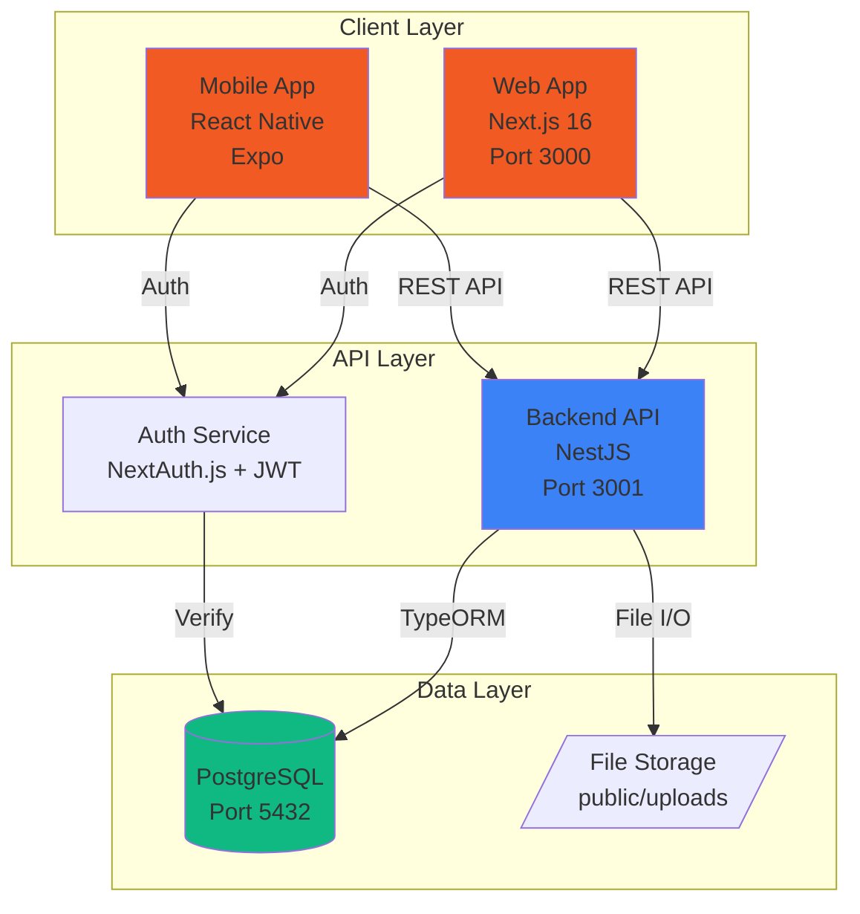
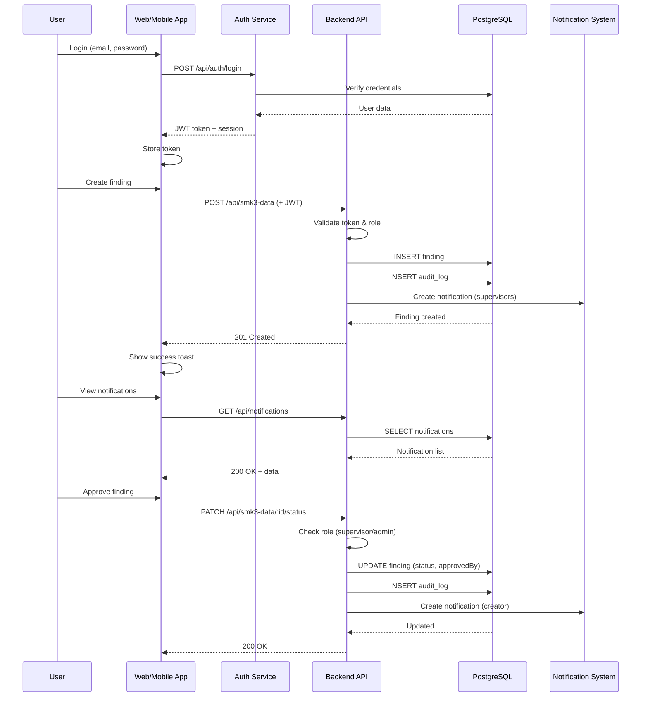
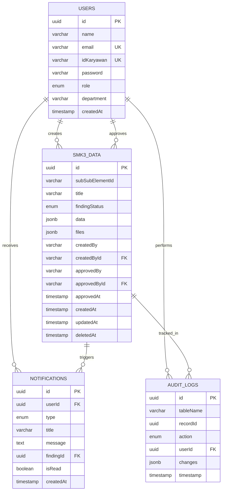
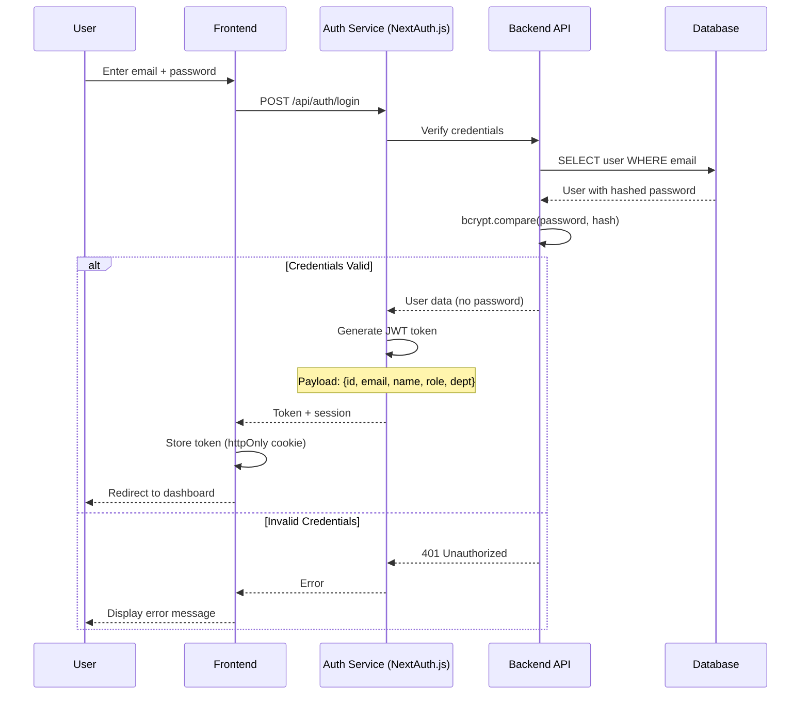

# Design Document - SMK3 MVP Phase 1

## Overview

SMK3 MVP Phase 1 is a proof-of-concept Occupational Health & Safety (OHS) management system designed to be implemented by a single amateur developer within one month. The system demonstrates end-to-end functionality from authentication through CRUD operations, approval workflows, notifications, and reporting.

### Goals

- **Demonstrate viability**: Show that the system can function end-to-end with real user interactions
- **Keep it simple**: Avoid over-engineering; use existing tech stack and patterns
- **Leverage existing code**: Build on BACKEND_SETUP.md flexible JSONB schema approach
- **Make it visible**: Focus on features that can be demonstrated (UI, workflows, reports)

### Design Principles

1. **Pragmatic over perfect**: Use proven libraries and patterns rather than building from scratch
2. **Flexible schema**: Leverage PostgreSQL JSONB to avoid frequent migrations
3. **Standard REST**: Follow conventional REST API design for predictability
4. **Progressive enhancement**: Build core features first, optimize later
5. **Mobile-first responsive**: Ensure UI works on all devices

### Tech Stack Summary

- **Frontend**: Next.js 16 (App Router), React 19, TypeScript, Tailwind CSS v4
- **Backend**: NestJS (to be integrated), PostgreSQL, TypeORM
- **Auth**: NextAuth.js with JWT
- **Mobile**: React Native (Expo)
- **Export**: xlsx (Excel), jsPDF (PDF)
- **Storage**: Local filesystem (public/uploads/)
- **Deployment**: Local development (Docker Compose for PostgreSQL)


## Architecture

### High-Level System Architecture




### Component Interaction Flow




### Technology Stack Breakdown

| Layer | Technology | Purpose | Port/Location |
|-------|-----------|---------|---------------|
| **Frontend Web** | Next.js 16 | Server-side rendering, routing, API routes | 3000 |
| | React 19 | UI components and interactions | - |
| | TypeScript | Type safety across codebase | - |
| | Tailwind CSS v4 | Utility-first styling | - |
| | NextAuth.js | Authentication management | - |
| | react-hot-toast | Toast notifications | - |
| | xlsx | Excel export generation | - |
| | jsPDF | PDF report generation | - |
| **Backend API** | NestJS | RESTful API framework | 3001 |
| | TypeORM | Database ORM and migrations | - |
| | bcrypt | Password hashing | - |
| | jsonwebtoken | JWT token generation/validation | - |
| | class-validator | Request validation | - |
| **Database** | PostgreSQL 16 | Primary database | 5432 |
| | pgAdmin 4 | Database management UI | 5050 |
| **Mobile** | React Native | Cross-platform mobile app | - |
| | Expo | Development tooling | - |
| | AsyncStorage | Local offline storage | - |
| | expo-camera | Camera integration | - |
| | react-native-paper | UI component library | - |
| **DevOps** | Docker Compose | Container orchestration | - |
| | Bun | Fast JavaScript runtime | - |


### Deployment Architecture (Local Development)

```
┌─────────────────────────────────────────────────────────┐
│  Developer Machine (Windows/Mac/Linux)                  │
│                                                          │
│  ┌────────────────────────────────────────────────┐    │
│  │  Frontend (Next.js)                             │    │
│  │  - bun run dev                                  │    │
│  │  - http://localhost:3000                        │    │
│  │  - Hot reload enabled                           │    │
│  └────────────────────────────────────────────────┘    │
│                                                          │
│  ┌────────────────────────────────────────────────┐    │
│  │  Backend (NestJS)                               │    │
│  │  - bun run dev                                  │    │
│  │  - http://localhost:3001                        │    │
│  │  - CORS: localhost:3000                         │    │
│  └────────────────────────────────────────────────┘    │
│                                                          │
│  ┌────────────────────────────────────────────────┐    │
│  │  Docker Compose                                 │    │
│  │  ┌─────────────────┐  ┌──────────────────┐    │    │
│  │  │  PostgreSQL     │  │  pgAdmin         │    │    │
│  │  │  Port: 5432     │  │  Port: 5050      │    │    │
│  │  └─────────────────┘  └──────────────────┘    │    │
│  └────────────────────────────────────────────────┘    │
│                                                          │
│  ┌────────────────────────────────────────────────┐    │
│  │  Mobile (Expo)                                  │    │
│  │  - expo start                                   │    │
│  │  - Connected via LAN to localhost:3001         │    │
│  └────────────────────────────────────────────────┘    │
└─────────────────────────────────────────────────────────┘
```


## Components and Interfaces

### Frontend Components (Next.js)

#### Page Structure (App Router)

```
app/
├── layout.tsx                    # Root layout with providers
├── page.tsx                      # Public homepage
├── login/
│   └── page.tsx                  # Login page
├── (authenticated)/              # Protected route group
│   ├── layout.tsx                # Authenticated layout with sidebar
│   ├── dashboard/
│   │   └── page.tsx              # Dashboard with statistics
│   ├── findings/
│   │   ├── page.tsx              # Findings list with filters
│   │   ├── new/
│   │   │   └── page.tsx          # Create finding form
│   │   └── [id]/
│   │       ├── page.tsx          # Finding detail view
│   │       └── edit/
│   │           └── page.tsx      # Edit finding form
│   └── notifications/
│       └── page.tsx              # Notifications list
└── api/
    ├── auth/
    │   └── [...nextauth]/
    │       └── route.ts          # NextAuth.js configuration
    └── proxy/                     # API proxy routes (optional)
        └── [...path]/
            └── route.ts
```


#### Component Library Structure

```
components/
├── ui/                           # Reusable UI components
│   ├── Button.tsx                # Button with variants
│   ├── Input.tsx                 # Form input with validation
│   ├── Select.tsx                # Dropdown select
│   ├── Textarea.tsx              # Text area input
│   ├── Card.tsx                  # Card container
│   ├── Badge.tsx                 # Status badge
│   ├── Modal.tsx                 # Modal dialog
│   ├── Spinner.tsx               # Loading spinner
│   └── EmptyState.tsx            # Empty state with icon
├── layout/
│   ├── Sidebar.tsx               # Navigation sidebar
│   ├── Header.tsx                # Page header with breadcrumbs
│   └── NotificationDropdown.tsx  # Notification bell + dropdown
├── findings/
│   ├── FindingCard.tsx           # Finding card for list
│   ├── FindingTable.tsx          # Findings data table
│   ├── FindingForm.tsx           # Create/edit form
│   ├── FileUpload.tsx            # File upload component
│   └── StatusBadge.tsx           # Status-specific badge
├── dashboard/
│   ├── StatCard.tsx              # Statistics card
│   └── RecentFindings.tsx        # Recent findings widget
└── shared/
    ├── Toast.tsx                 # Toast notification wrapper
    └── ProtectedRoute.tsx        # Auth guard wrapper
```


#### State Management Strategy

For MVP, we'll use **React Context + hooks** for simplicity:

```typescript
// contexts/AuthContext.tsx
interface AuthContextType {
  user: User | null;
  login: (email: string, password: string) => Promise<void>;
  logout: () => Promise<void>;
  isLoading: boolean;
}

// contexts/NotificationContext.tsx
interface NotificationContextType {
  notifications: Notification[];
  unreadCount: number;
  markAsRead: (id: string) => Promise<void>;
  markAllAsRead: () => Promise<void>;
  refreshNotifications: () => Promise<void>;
}

// Usage in components:
const { user, logout } = useAuth();
const { notifications, unreadCount } = useNotifications();
```

**Why Context over Zustand for MVP:**
- Simpler setup, fewer dependencies
- Sufficient for limited state needs
- Can migrate to Zustand later if needed


#### Form Handling and Validation

```typescript
// Using React Hook Form + Zod for validation
import { useForm } from 'react-hook-form';
import { zodResolver } from '@hookform/resolvers/zod';
import { z } from 'zod';

const findingSchema = z.object({
  title: z.string().min(5, 'Title minimal 5 karakter'),
  tanggal: z.string().min(1, 'Tanggal wajib diisi'),
  lokasi: z.string().min(1, 'Lokasi wajib diisi'),
  deskripsi: z.string().min(10, 'Deskripsi minimal 10 karakter'),
  kategori: z.string().optional(),
  levelHazard: z.enum(['Low', 'Medium', 'High', 'Critical']),
  status: z.enum(['OPEN', 'INPG', 'CLSD']),
});

type FindingFormData = z.infer<typeof findingSchema>;

export function FindingForm() {
  const { register, handleSubmit, formState: { errors } } = useForm<FindingFormData>({
    resolver: zodResolver(findingSchema),
  });

  const onSubmit = async (data: FindingFormData) => {
    // API call logic
  };

  return <form onSubmit={handleSubmit(onSubmit)}>...</form>;
}
```


#### Notification Polling Mechanism

```typescript
// hooks/useNotificationPolling.ts
import { useEffect } from 'react';
import { useNotifications } from '@/contexts/NotificationContext';

export function useNotificationPolling(intervalMs = 30000) {
  const { refreshNotifications } = useNotifications();

  useEffect(() => {
    // Initial fetch
    refreshNotifications();

    // Poll every 30 seconds
    const interval = setInterval(() => {
      refreshNotifications();
    }, intervalMs);

    return () => clearInterval(interval);
  }, [refreshNotifications, intervalMs]);
}

// Usage in layout:
export default function AuthenticatedLayout({ children }) {
  useNotificationPolling();
  
  return (
    <div>
      <Sidebar />
      <Header />
      {children}
    </div>
  );
}
```


### Backend Components (NestJS)

#### Module Structure

```
src/
├── main.ts                       # Application entry point
├── app.module.ts                 # Root module
├── auth/
│   ├── auth.module.ts
│   ├── auth.controller.ts        # Login endpoint
│   ├── auth.service.ts           # JWT generation, validation
│   ├── strategies/
│   │   └── jwt.strategy.ts       # JWT passport strategy
│   └── guards/
│       ├── jwt-auth.guard.ts     # JWT authentication guard
│       └── roles.guard.ts        # Role-based authorization guard
├── users/
│   ├── users.module.ts
│   ├── users.controller.ts       # User CRUD (admin only)
│   ├── users.service.ts
│   └── entities/
│       └── user.entity.ts        # TypeORM entity
├── findings/
│   ├── findings.module.ts
│   ├── findings.controller.ts    # CRUD + status update
│   ├── findings.service.ts
│   └── entities/
│       └── finding.entity.ts     # smk3_data table
├── notifications/
│   ├── notifications.module.ts
│   ├── notifications.controller.ts
│   ├── notifications.service.ts
│   └── entities/
│       └── notification.entity.ts
├── audit/
│   ├── audit.module.ts
│   ├── audit.service.ts          # Logging service
│   └── entities/
│       └── audit-log.entity.ts
├── uploads/
│   ├── uploads.module.ts
│   ├── uploads.controller.ts     # File upload endpoint
│   └── uploads.service.ts        # File handling logic
└── common/
    ├── decorators/
    │   └── roles.decorator.ts    # @Roles() decorator
    ├── filters/
    │   └── http-exception.filter.ts
    └── interceptors/
        └── audit.interceptor.ts  # Auto-audit logging
```


## Data Models

### Entity Relationship Diagram (ERD)




### Database Schema Details

#### 1. Users Table

```sql
CREATE TABLE users (
    id UUID PRIMARY KEY DEFAULT gen_random_uuid(),
    name VARCHAR(255) NOT NULL,
    email VARCHAR(255) NOT NULL UNIQUE,
    idKaryawan VARCHAR(50) NOT NULL UNIQUE,
    password VARCHAR(255) NOT NULL, -- bcrypt hashed
    role VARCHAR(20) NOT NULL CHECK (role IN ('admin', 'supervisor', 'user')),
    department VARCHAR(100),
    createdAt TIMESTAMP DEFAULT CURRENT_TIMESTAMP
);

CREATE INDEX idx_users_email ON users(email);
CREATE INDEX idx_users_role ON users(role);
CREATE INDEX idx_users_department ON users(department);
```

**Seed Data:**

```sql
INSERT INTO users (name, email, idKaryawan, password, role, department) VALUES
('Admin User', 'admin@smk3.local', 'ADM001', '$2b$10$...', 'admin', NULL),
('Safety Supervisor', 'supervisor@smk3.local', 'SUP001', '$2b$10$...', 'supervisor', 'Safety'),
('Production User', 'user@smk3.local', 'USR001', '$2b$10$...', 'user', 'Production');
```


#### 2. SMK3_Data Table (Findings)

```sql
CREATE TABLE smk3_data (
    id UUID PRIMARY KEY DEFAULT gen_random_uuid(),
    subSubElementId VARCHAR(100) NOT NULL,
    title VARCHAR(255) NOT NULL,
    findingStatus VARCHAR(10) NOT NULL CHECK (findingStatus IN ('OPEN', 'INPG', 'CLSD')),
    data JSONB, -- Flexible schema for form fields
    files JSONB, -- Array of file paths
    createdBy VARCHAR(255) NOT NULL,
    createdById UUID NOT NULL REFERENCES users(id),
    approvedBy VARCHAR(255),
    approvedById UUID REFERENCES users(id),
    approvedAt TIMESTAMP,
    createdAt TIMESTAMP DEFAULT CURRENT_TIMESTAMP,
    updatedAt TIMESTAMP DEFAULT CURRENT_TIMESTAMP,
    deletedAt TIMESTAMP
);

CREATE INDEX idx_smk3_status ON smk3_data(findingStatus);
CREATE INDEX idx_smk3_sub_element ON smk3_data(subSubElementId);
CREATE INDEX idx_smk3_creator ON smk3_data(createdById);
CREATE INDEX idx_smk3_created ON smk3_data(createdAt);
CREATE INDEX idx_smk3_deleted ON smk3_data(deletedAt);
CREATE INDEX idx_smk3_data_gin ON smk3_data USING gin(data); -- JSONB index
```

**Example JSONB Data Field:**

```json
{
  "tanggalInspeksi": "2026-07-14",
  "lokasiUtama": "Area A - Smelting",
  "kategoriHazard": "10",
  "levelHazard": "High",
  "deskripsiKetidaksesuaian": "Loose electrical wiring exposed...",
  "rekomendasiPerbaikan": "Secure wiring and add protective covering"
}
```


#### 3. Audit_Logs Table

```sql
CREATE TABLE audit_logs (
    id UUID PRIMARY KEY DEFAULT gen_random_uuid(),
    tableName VARCHAR(100) NOT NULL,
    recordId UUID NOT NULL,
    action VARCHAR(20) NOT NULL CHECK (action IN ('CREATE', 'UPDATE', 'DELETE')),
    userId UUID NOT NULL REFERENCES users(id),
    changes JSONB, -- Before/after data
    timestamp TIMESTAMP DEFAULT CURRENT_TIMESTAMP
);

CREATE INDEX idx_audit_table ON audit_logs(tableName);
CREATE INDEX idx_audit_record ON audit_logs(recordId);
CREATE INDEX idx_audit_user ON audit_logs(userId);
CREATE INDEX idx_audit_timestamp ON audit_logs(timestamp);
```

**Example Changes Field:**

```json
{
  "before": {
    "findingStatus": "OPEN",
    "approvedBy": null
  },
  "after": {
    "findingStatus": "INPG",
    "approvedBy": "Safety Supervisor",
    "approvedById": "uuid-here"
  }
}
```


#### 4. Notifications Table

```sql
CREATE TABLE notifications (
    id UUID PRIMARY KEY DEFAULT gen_random_uuid(),
    userId UUID NOT NULL REFERENCES users(id),
    type VARCHAR(50) NOT NULL CHECK (type IN (
        'finding_submitted',
        'approval_required',
        'finding_approved',
        'finding_rejected'
    )),
    title VARCHAR(255) NOT NULL,
    message TEXT NOT NULL,
    findingId UUID REFERENCES smk3_data(id),
    isRead BOOLEAN DEFAULT FALSE,
    createdAt TIMESTAMP DEFAULT CURRENT_TIMESTAMP
);

CREATE INDEX idx_notif_user ON notifications(userId);
CREATE INDEX idx_notif_read ON notifications(isRead);
CREATE INDEX idx_notif_created ON notifications(createdAt);
CREATE INDEX idx_notif_type ON notifications(type);
```

**Example Notifications:**

```sql
-- For creator when finding is submitted
INSERT INTO notifications (userId, type, title, message, findingId, isRead)
VALUES (
    'creator-uuid',
    'finding_submitted',
    'Finding Submitted',
    'Finding "Electrical Hazard" telah disubmit',
    'finding-uuid',
    FALSE
);

-- For supervisors when approval is needed
INSERT INTO notifications (userId, type, title, message, findingId, isRead)
VALUES (
    'supervisor-uuid',
    'approval_required',
    'New Finding Requires Approval',
    'Finding baru memerlukan approval: "Electrical Hazard"',
    'finding-uuid',
    FALSE
);
```


### TypeORM Entities

#### User Entity

```typescript
// users/entities/user.entity.ts
import { Entity, Column, PrimaryGeneratedColumn, CreateDateColumn } from 'typeorm';

@Entity('users')
export class User {
  @PrimaryGeneratedColumn('uuid')
  id: string;

  @Column({ type: 'varchar', length: 255 })
  name: string;

  @Column({ type: 'varchar', length: 255, unique: true })
  email: string;

  @Column({ type: 'varchar', length: 50, unique: true })
  idKaryawan: string;

  @Column({ type: 'varchar', length: 255, select: false }) // Don't select by default
  password: string;

  @Column({
    type: 'enum',
    enum: ['admin', 'supervisor', 'user'],
  })
  role: 'admin' | 'supervisor' | 'user';

  @Column({ type: 'varchar', length: 100, nullable: true })
  department?: string;

  @CreateDateColumn()
  createdAt: Date;
}
```


#### Finding Entity

```typescript
// findings/entities/finding.entity.ts
import { Entity, Column, PrimaryGeneratedColumn, CreateDateColumn, UpdateDateColumn, ManyToOne, JoinColumn } from 'typeorm';
import { User } from '../../users/entities/user.entity';

@Entity('smk3_data')
export class Finding {
  @PrimaryGeneratedColumn('uuid')
  id: string;

  @Column({ type: 'varchar', length: 100 })
  subSubElementId: string;

  @Column({ type: 'varchar', length: 255 })
  title: string;

  @Column({
    type: 'enum',
    enum: ['OPEN', 'INPG', 'CLSD'],
  })
  findingStatus: 'OPEN' | 'INPG' | 'CLSD';

  @Column({ type: 'jsonb', nullable: true })
  data?: Record<string, any>;

  @Column({ type: 'jsonb', nullable: true })
  files?: string[];

  @Column({ type: 'varchar', length: 255 })
  createdBy: string;

  @Column({ type: 'uuid' })
  createdById: string;

  @ManyToOne(() => User)
  @JoinColumn({ name: 'createdById' })
  creator: User;

  @Column({ type: 'varchar', length: 255, nullable: true })
  approvedBy?: string;

  @Column({ type: 'uuid', nullable: true })
  approvedById?: string;

  @ManyToOne(() => User)
  @JoinColumn({ name: 'approvedById' })
  approver?: User;

  @Column({ type: 'timestamp', nullable: true })
  approvedAt?: Date;

  @CreateDateColumn()
  createdAt: Date;

  @UpdateDateColumn()
  updatedAt: Date;

  @Column({ type: 'timestamp', nullable: true })
  deletedAt?: Date;
}
```


#### Notification Entity

```typescript
// notifications/entities/notification.entity.ts
import { Entity, Column, PrimaryGeneratedColumn, CreateDateColumn, ManyToOne, JoinColumn } from 'typeorm';
import { User } from '../../users/entities/user.entity';
import { Finding } from '../../findings/entities/finding.entity';

@Entity('notifications')
export class Notification {
  @PrimaryGeneratedColumn('uuid')
  id: string;

  @Column({ type: 'uuid' })
  userId: string;

  @ManyToOne(() => User)
  @JoinColumn({ name: 'userId' })
  user: User;

  @Column({
    type: 'enum',
    enum: ['finding_submitted', 'approval_required', 'finding_approved', 'finding_rejected'],
  })
  type: 'finding_submitted' | 'approval_required' | 'finding_approved' | 'finding_rejected';

  @Column({ type: 'varchar', length: 255 })
  title: string;

  @Column({ type: 'text' })
  message: string;

  @Column({ type: 'uuid', nullable: true })
  findingId?: string;

  @ManyToOne(() => Finding)
  @JoinColumn({ name: 'findingId' })
  finding?: Finding;

  @Column({ type: 'boolean', default: false })
  isRead: boolean;

  @CreateDateColumn()
  createdAt: Date;
}
```


#### Audit Log Entity

```typescript
// audit/entities/audit-log.entity.ts
import { Entity, Column, PrimaryGeneratedColumn, CreateDateColumn, ManyToOne, JoinColumn } from 'typeorm';
import { User } from '../../users/entities/user.entity';

@Entity('audit_logs')
export class AuditLog {
  @PrimaryGeneratedColumn('uuid')
  id: string;

  @Column({ type: 'varchar', length: 100 })
  tableName: string;

  @Column({ type: 'uuid' })
  recordId: string;

  @Column({
    type: 'enum',
    enum: ['CREATE', 'UPDATE', 'DELETE'],
  })
  action: 'CREATE' | 'UPDATE' | 'DELETE';

  @Column({ type: 'uuid' })
  userId: string;

  @ManyToOne(() => User)
  @JoinColumn({ name: 'userId' })
  user: User;

  @Column({ type: 'jsonb', nullable: true })
  changes?: Record<string, any>;

  @CreateDateColumn()
  timestamp: Date;
}
```


## API Endpoints

### Authentication Endpoints

#### POST /api/auth/login

**Description**: Authenticate user and generate JWT token

**Request Body**:
```json
{
  "email": "user@smk3.local",
  "password": "user123"
}
```

**Success Response** (200 OK):
```json
{
  "user": {
    "id": "uuid-here",
    "email": "user@smk3.local",
    "name": "Production User",
    "role": "user",
    "department": "Production"
  },
  "token": "eyJhbGciOiJIUzI1NiIs..."
}
```

**Error Responses**:
- 401 Unauthorized: Invalid credentials
- 400 Bad Request: Missing required fields


### Findings Endpoints

#### GET /api/smk3-data

**Description**: Get all findings with optional filters

**Query Parameters**:
- `subSubElementId` (optional): Filter by sub-element ID
- `findingStatus` (optional): Filter by status (OPEN/INPG/CLSD)
- `createdById` (optional): Filter by creator user ID
- `department` (optional): Filter by department (for supervisors)

**Success Response** (200 OK):
```json
[
  {
    "id": "uuid-here",
    "subSubElementId": "7-1-1-1",
    "title": "Electrical Hazard at Area A",
    "findingStatus": "OPEN",
    "data": {
      "tanggalInspeksi": "2026-07-14",
      "lokasiUtama": "Area A - Smelting",
      "levelHazard": "High",
      "deskripsiKetidaksesuaian": "Loose wiring..."
    },
    "files": ["/uploads/smk3/7-1-1-1/file1.jpg"],
    "createdBy": "Production User",
    "createdById": "uuid",
    "approvedBy": null,
    "approvedById": null,
    "approvedAt": null,
    "createdAt": "2026-07-14T10:30:00Z",
    "updatedAt": "2026-07-14T10:30:00Z"
  }
]
```

**Authorization**: JWT token required


#### POST /api/smk3-data

**Description**: Create a new finding

**Request Body**:
```json
{
  "subSubElementId": "7-1-1-1",
  "title": "Electrical Hazard at Area A",
  "findingStatus": "OPEN",
  "createdBy": "Production User",
  "createdById": "uuid-here",
  "data": {
    "tanggalInspeksi": "2026-07-14",
    "lokasiUtama": "Area A",
    "levelHazard": "High",
    "deskripsiKetidaksesuaian": "Description..."
  },
  "files": []
}
```

**Success Response** (201 Created):
```json
{
  "id": "new-uuid",
  "subSubElementId": "7-1-1-1",
  "title": "Electrical Hazard at Area A",
  "findingStatus": "OPEN",
  "createdAt": "2026-07-14T10:30:00Z"
}
```

**Error Responses**:
- 400 Bad Request: Missing required fields or validation error
- 401 Unauthorized: Missing or invalid JWT token


#### GET /api/smk3-data/:id

**Description**: Get a single finding by ID

**Success Response** (200 OK): Same structure as POST response with all fields populated

**Error Responses**:
- 404 Not Found: Finding not found
- 401 Unauthorized: Missing or invalid JWT token


#### PUT /api/smk3-data/:id

**Description**: Update an existing finding

**Request Body**: Same as POST endpoint

**Success Response** (200 OK): Updated finding object

**Error Responses**:
- 400 Bad Request: Validation error
- 404 Not Found: Finding not found
- 401 Unauthorized: Missing or invalid JWT token
- 403 Forbidden: User cannot edit this finding (not OPEN status or not creator)


#### PATCH /api/smk3-data/:id/status

**Description**: Update finding status (approval/rejection workflow)

**Request Body**:
```json
{
  "findingStatus": "INPG",
  "approvedBy": "Safety Supervisor",
  "approvedById": "uuid-here",
  "approvedAt": "2026-07-15T09:00:00Z"
}
```

**Success Response** (200 OK): Updated finding object

**Error Responses**:
- 403 Forbidden: User role not authorized (must be supervisor or admin)
- 404 Not Found: Finding not found
- 401 Unauthorized: Missing or invalid JWT token

**Business Logic**:
- Only users with role "supervisor" or "admin" can approve
- Approving changes status from OPEN → INPG
- Creates notification for finding creator
- Logs action in audit_logs table


#### DELETE /api/smk3-data/:id

**Description**: Soft delete a finding

**Success Response** (200 OK):
```json
{
  "message": "Finding deleted successfully"
}
```

**Error Responses**:
- 404 Not Found: Finding not found
- 401 Unauthorized: Missing or invalid JWT token
- 403 Forbidden: User not authorized to delete

**Business Logic**:
- Sets deletedAt timestamp instead of hard delete
- Logs action in audit_logs table
- Only creator or admin can delete


### Notifications Endpoints

#### GET /api/notifications

**Description**: Get all notifications for authenticated user

**Query Parameters**:
- `isRead` (optional): Filter by read status (true/false)
- `limit` (optional): Limit number of results (default: 50)

**Success Response** (200 OK):
```json
[
  {
    "id": "uuid",
    "userId": "uuid",
    "type": "approval_required",
    "title": "New Finding Requires Approval",
    "message": "Finding baru memerlukan approval: Electrical Hazard",
    "findingId": "finding-uuid",
    "isRead": false,
    "createdAt": "2026-07-14T10:31:00Z"
  }
]
```

**Authorization**: JWT token required


#### PATCH /api/notifications/:id/read

**Description**: Mark a single notification as read

**Success Response** (200 OK):
```json
{
  "id": "uuid",
  "isRead": true
}
```


#### PATCH /api/notifications/read-all

**Description**: Mark all user's notifications as read

**Success Response** (200 OK):
```json
{
  "updatedCount": 5,
  "message": "All notifications marked as read"
}
```


### File Upload Endpoints

#### POST /api/uploads

**Description**: Upload a file (image)

**Request**: multipart/form-data with file field

**Success Response** (201 Created):
```json
{
  "filename": "1720961234567-abc123.jpg",
  "path": "/uploads/smk3/7-1-1-1/1720961234567-abc123.jpg",
  "size": 245678,
  "mimetype": "image/jpeg"
}
```

**Error Responses**:
- 400 Bad Request: Invalid file type or size exceeds 5MB
- 401 Unauthorized: Missing or invalid JWT token

**Validation**:
- Allowed types: image/jpeg, image/png, image/jpg
- Max size: 5MB
- Filename sanitization and unique naming


### Users Endpoints (Admin Only)

#### GET /api/users

**Description**: Get all users (admin only)

**Success Response** (200 OK): Array of user objects without password field

**Authorization**: JWT token with role "admin" required


#### POST /api/users

**Description**: Create a new user (admin only)

**Request Body**:
```json
{
  "name": "New User",
  "email": "newuser@smk3.local",
  "idKaryawan": "USR002",
  "password": "password123",
  "role": "user",
  "department": "Production"
}
```

**Success Response** (201 Created): User object without password


#### DELETE /api/users/:id

**Description**: Delete a user (admin only)

**Success Response** (200 OK):
```json
{
  "message": "User deleted successfully"
}
```


## Security Design

### Authentication Flow




### Password Security

**Hashing Strategy**: bcrypt with salt rounds = 10

```typescript
// auth/auth.service.ts
import * as bcrypt from 'bcrypt';

export class AuthService {
  private readonly SALT_ROUNDS = 10;

  async hashPassword(password: string): Promise<string> {
    return bcrypt.hash(password, this.SALT_ROUNDS);
  }

  async validatePassword(password: string, hash: string): Promise<boolean> {
    return bcrypt.compare(password, hash);
  }
}
```

**Password Requirements** (for production):
- Minimum 8 characters
- At least 1 uppercase letter
- At least 1 number
- At least 1 special character

**MVP Simplified**: For demo purposes, MVP uses simple passwords (admin123, user123) for easy testing.


### JWT Token Design

**Token Payload**:
```json
{
  "sub": "user-uuid",
  "email": "user@smk3.local",
  "name": "Production User",
  "role": "user",
  "department": "Production",
  "iat": 1720961234,
  "exp": 1721566034
}
```

**Token Configuration**:
- Algorithm: HS256 (HMAC with SHA-256)
- Secret: Stored in environment variable `JWT_SECRET`
- Expiration: 7 days (604800 seconds)
- Storage: httpOnly cookie (web), AsyncStorage (mobile)

**Token Generation**:
```typescript
// auth/auth.service.ts
import { JwtService } from '@nestjs/jwt';

export class AuthService {
  constructor(private jwtService: JwtService) {}

  async generateToken(user: User): Promise<string> {
    const payload = {
      sub: user.id,
      email: user.email,
      name: user.name,
      role: user.role,
      department: user.department,
    };
    
    return this.jwtService.sign(payload, {
      expiresIn: '7d',
    });
  }
}
```


### Role-Based Access Control (RBAC)

**Role Hierarchy**:
```
admin (full access)
  └── supervisor (department-level access)
        └── user (own data only)
```

**Permission Matrix**:

| Feature | User | Supervisor | Admin |
|---------|------|------------|-------|
| Create finding | ✓ | ✓ | ✓ |
| View own findings | ✓ | ✓ | ✓ |
| View department findings | ✗ | ✓ | ✓ |
| View all findings | ✗ | ✗ | ✓ |
| Edit own OPEN findings | ✓ | ✓ | ✓ |
| Edit any finding | ✗ | ✗ | ✓ |
| Approve/reject findings | ✗ | ✓ | ✓ |
| Delete own findings | ✓ | ✓ | ✓ |
| Delete any findings | ✗ | ✗ | ✓ |
| Manage users | ✗ | ✗ | ✓ |
| View audit logs | ✗ | ✗ | ✓ |


**Implementation - Backend Guards**:

```typescript
// common/guards/roles.guard.ts
import { Injectable, CanActivate, ExecutionContext } from '@nestjs/common';
import { Reflector } from '@nestjs/core';

@Injectable()
export class RolesGuard implements CanActivate {
  constructor(private reflector: Reflector) {}

  canActivate(context: ExecutionContext): boolean {
    const requiredRoles = this.reflector.get<string[]>('roles', context.getHandler());
    if (!requiredRoles) {
      return true;
    }

    const request = context.switchToHttp().getRequest();
    const user = request.user;
    
    return requiredRoles.some((role) => user.role === role);
  }
}
```

**Usage in Controllers**:
```typescript
// findings/findings.controller.ts
import { UseGuards } from '@nestjs/common';
import { JwtAuthGuard } from '../auth/guards/jwt-auth.guard';
import { RolesGuard } from '../common/guards/roles.guard';
import { Roles } from '../common/decorators/roles.decorator';

@Controller('smk3-data')
@UseGuards(JwtAuthGuard)
export class FindingsController {
  
  @Get()
  findAll(@Request() req) {
    // All authenticated users can view findings
    // But filter by department for supervisors
    return this.findingsService.findAll(req.user);
  }

  @Patch(':id/status')
  @UseGuards(RolesGuard)
  @Roles('supervisor', 'admin')
  async updateStatus(@Param('id') id: string, @Body() dto: UpdateStatusDto) {
    // Only supervisors and admins can approve/reject
    return this.findingsService.updateStatus(id, dto);
  }

  @Delete(':id')
  @UseGuards(RolesGuard)
  @Roles('admin')
  async delete(@Param('id') id: string) {
    // Only admins can delete any finding
    return this.findingsService.delete(id);
  }
}
```


### CORS Configuration

**Allowed Origins** (Development):
- `http://localhost:3000` (Next.js frontend)
- `http://192.168.x.x:3000` (Mobile app via LAN)

```typescript
// main.ts
import { NestFactory } from '@nestjs/core';
import { AppModule } from './app.module';

async function bootstrap() {
  const app = await NestFactory.create(AppModule);
  
  app.enableCors({
    origin: [
      'http://localhost:3000',
      /^http:\/\/192\.168\.\d{1,3}\.\d{1,3}:3000$/
    ],
    credentials: true,
    methods: ['GET', 'POST', 'PUT', 'PATCH', 'DELETE'],
    allowedHeaders: ['Content-Type', 'Authorization'],
  });

  await app.listen(3001);
}
bootstrap();
```


### Input Validation and Sanitization

**Validation Strategy**: Use class-validator and class-transformer for DTO validation

```typescript
// findings/dto/create-finding.dto.ts
import { IsString, IsNotEmpty, IsUUID, IsEnum, IsOptional, MinLength } from 'class-validator';

export class CreateFindingDto {
  @IsString()
  @IsNotEmpty()
  subSubElementId: string;

  @IsString()
  @IsNotEmpty()
  @MinLength(5, { message: 'Title must be at least 5 characters' })
  title: string;

  @IsEnum(['OPEN', 'INPG', 'CLSD'])
  findingStatus: string;

  @IsString()
  @IsNotEmpty()
  createdBy: string;

  @IsUUID()
  createdById: string;

  @IsOptional()
  data?: Record<string, any>;

  @IsOptional()
  files?: string[];
}
```

**Enable Validation Globally**:
```typescript
// main.ts
import { ValidationPipe } from '@nestjs/common';

async function bootstrap() {
  const app = await NestFactory.create(AppModule);
  
  app.useGlobalPipes(new ValidationPipe({
    whitelist: true, // Strip unknown properties
    forbidNonWhitelisted: true, // Throw error if unknown properties
    transform: true, // Auto-transform payloads to DTO types
  }));

  await app.listen(3001);
}
```


### SQL Injection Prevention

**Protection via TypeORM Parameterized Queries**:

TypeORM automatically uses parameterized queries, preventing SQL injection:

```typescript
// findings/findings.service.ts
async findAll(filters: FindingFiltersDto) {
  const query = this.findingsRepository.createQueryBuilder('finding');

  if (filters.findingStatus) {
    // TypeORM automatically parameterizes this
    query.andWhere('finding.findingStatus = :status', { status: filters.findingStatus });
  }

  if (filters.createdById) {
    query.andWhere('finding.createdById = :createdById', { createdById: filters.createdById });
  }

  return query.getMany();
}
```

**Never use raw SQL with string concatenation**. Always use parameterized queries.


### XSS Protection

**Frontend**: React automatically escapes values in JSX, preventing XSS

**Backend**: Sanitize HTML in text fields if rich text is allowed

```typescript
// For MVP, we store plain text only, no HTML
// If HTML is needed later, use DOMPurify or similar
import * as sanitizeHtml from 'sanitize-html';

function sanitizeInput(input: string): string {
  return sanitizeHtml(input, {
    allowedTags: [], // No HTML tags allowed for MVP
    allowedAttributes: {},
  });
}
```


### File Upload Security

**File Type Validation**:
```typescript
// uploads/uploads.service.ts
const ALLOWED_MIME_TYPES = ['image/jpeg', 'image/jpg', 'image/png'];
const MAX_FILE_SIZE = 5 * 1024 * 1024; // 5MB

async validateFile(file: Express.Multer.File) {
  if (!ALLOWED_MIME_TYPES.includes(file.mimetype)) {
    throw new BadRequestException('Only image files are allowed');
  }

  if (file.size > MAX_FILE_SIZE) {
    throw new BadRequestException('File size must be less than 5MB');
  }
}
```

**Filename Sanitization**:
```typescript
function sanitizeFilename(originalName: string): string {
  const timestamp = Date.now();
  const randomStr = Math.random().toString(36).substring(7);
  const ext = path.extname(originalName);
  
  // Remove all non-alphanumeric except extension
  const safeName = `${timestamp}-${randomStr}${ext}`;
  return safeName;
}
```

**Storage Path Isolation**: Files stored in `public/uploads/smk3/{subSubElementId}/` to prevent directory traversal


### Rate Limiting (Future Enhancement)

For production, implement rate limiting to prevent abuse:

```typescript
// main.ts
import * as rateLimit from 'express-rate-limit';

const limiter = rateLimit({
  windowMs: 15 * 60 * 1000, // 15 minutes
  max: 100, // Limit each IP to 100 requests per windowMs
});

app.use(limiter);
```


### Audit Logging

All CREATE, UPDATE, DELETE operations on findings are automatically logged:

```typescript
// common/interceptors/audit.interceptor.ts
import { Injectable, NestInterceptor, ExecutionContext, CallHandler } from '@nestjs/common';
import { Observable } from 'rxjs';
import { tap } from 'rxjs/operators';

@Injectable()
export class AuditInterceptor implements NestInterceptor {
  constructor(private auditService: AuditService) {}

  intercept(context: ExecutionContext, next: CallHandler): Observable<any> {
    const request = context.switchToHttp().getRequest();
    const { user, method, url } = request;

    return next.handle().pipe(
      tap(async (data) => {
        if (['POST', 'PUT', 'PATCH', 'DELETE'].includes(method)) {
          await this.auditService.log({
            userId: user.id,
            action: this.mapMethodToAction(method),
            tableName: this.extractTableName(url),
            recordId: data?.id,
            changes: data,
          });
        }
      }),
    );
  }

  private mapMethodToAction(method: string): 'CREATE' | 'UPDATE' | 'DELETE' {
    const map = { POST: 'CREATE', PUT: 'UPDATE', PATCH: 'UPDATE', DELETE: 'DELETE' };
    return map[method];
  }

  private extractTableName(url: string): string {
    // Extract from URL, e.g., /api/smk3-data -> smk3_data
    if (url.includes('smk3-data')) return 'smk3_data';
    if (url.includes('users')) return 'users';
    return 'unknown';
  }
}
```


## Export Module

### Excel Export (Findings List)

**Library**: xlsx (SheetJS)

**Implementation**:

```typescript
// lib/exportExcel.ts
import * as XLSX from 'xlsx';
import { Finding } from '@/types';

export function exportFindingsToExcel(findings: Finding[], filename: string = 'findings-export') {
  // Prepare data for Excel
  const data = findings.map(finding => ({
    'Title': finding.title,
    'Status': finding.findingStatus,
    'Location': finding.data?.lokasiUtama || '-',
    'Date': new Date(finding.createdAt).toLocaleDateString('id-ID'),
    'Category': finding.data?.kategoriHazard || '-',
    'Hazard Level': finding.data?.levelHazard || '-',
    'Created By': finding.createdBy,
    'Approved By': finding.approvedBy || 'Pending',
    'Approved At': finding.approvedAt ? new Date(finding.approvedAt).toLocaleDateString('id-ID') : '-',
  }));

  // Create workbook and worksheet
  const worksheet = XLSX.utils.json_to_sheet(data);
  const workbook = XLSX.utils.book_new();
  XLSX.utils.book_append_sheet(workbook, worksheet, 'Findings');

  // Apply column widths
  const maxWidth = 30;
  worksheet['!cols'] = [
    { wch: 30 }, // Title
    { wch: 10 }, // Status
    { wch: 25 }, // Location
    { wch: 12 }, // Date
    { wch: 15 }, // Category
    { wch: 12 }, // Hazard Level
    { wch: 20 }, // Created By
    { wch: 20 }, // Approved By
    { wch: 12 }, // Approved At
  ];

  // Apply header styling
  const range = XLSX.utils.decode_range(worksheet['!ref']!);
  for (let C = range.s.c; C <= range.e.c; ++C) {
    const address = XLSX.utils.encode_col(C) + '1'; // First row
    if (!worksheet[address]) continue;
    worksheet[address].s = {
      font: { bold: true },
      fill: { fgColor: { rgb: 'F15A22' } }, // Orange header
      alignment: { horizontal: 'center' },
    };
  }

  // Generate file and download
  const timestamp = new Date().toISOString().split('T')[0];
  const fileName = `${filename}-${timestamp}.xlsx`;
  XLSX.writeFile(workbook, fileName);
}
```

**Usage in Component**:

```typescript
// components/findings/FindingTable.tsx
import { exportFindingsToExcel } from '@/lib/exportExcel';

export function FindingTable({ findings }: { findings: Finding[] }) {
  const handleExport = () => {
    exportFindingsToExcel(findings, 'findings-export');
    toast.success('Excel file generated successfully');
  };

  return (
    <div>
      <button onClick={handleExport} className="btn-primary">
        Export to Excel
      </button>
      {/* Table content */}
    </div>
  );
}
```


### PDF Export (Finding Detail)

**Library**: jsPDF + jspdf-autotable for tables

**Implementation**:

```typescript
// lib/exportPdf.ts
import jsPDF from 'jspdf';
import autoTable from 'jspdf-autotable';
import { Finding } from '@/types';

export async function exportFindingToPDF(finding: Finding) {
  const doc = new jsPDF();

  // Add company logo (if available)
  // const logo = await loadImage('/logo.png');
  // doc.addImage(logo, 'PNG', 15, 10, 30, 15);

  // Header
  doc.setFontSize(18);
  doc.setTextColor(241, 90, 34); // Orange
  doc.text('SMK3 Finding Report', 105, 20, { align: 'center' });

  doc.setFontSize(10);
  doc.setTextColor(0, 0, 0);
  doc.text(`Generated: ${new Date().toLocaleString('id-ID')}`, 105, 27, { align: 'center' });

  // Finding details table
  autoTable(doc, {
    startY: 35,
    head: [['Field', 'Value']],
    body: [
      ['Title', finding.title],
      ['Status', finding.findingStatus],
      ['Date', new Date(finding.createdAt).toLocaleDateString('id-ID')],
      ['Location', finding.data?.lokasiUtama || '-'],
      ['Category', finding.data?.kategoriHazard || '-'],
      ['Hazard Level', finding.data?.levelHazard || '-'],
      ['Description', finding.data?.deskripsiKetidaksesuaian || '-'],
      ['Recommendation', finding.data?.rekomendasiPerbaikan || '-'],
      ['Created By', finding.createdBy],
      ['Approved By', finding.approvedBy || 'Pending'],
      ['Approved At', finding.approvedAt ? new Date(finding.approvedAt).toLocaleString('id-ID') : '-'],
    ],
    theme: 'grid',
    headStyles: { fillColor: [241, 90, 34], textColor: [255, 255, 255] },
    columnStyles: {
      0: { cellWidth: 50, fontStyle: 'bold' },
      1: { cellWidth: 'auto' },
    },
  });

  // Add photos if available
  if (finding.files && finding.files.length > 0) {
    const finalY = (doc as any).lastAutoTable.finalY || 35;
    doc.setFontSize(12);
    doc.setFont('helvetica', 'bold');
    doc.text('Attached Photos:', 15, finalY + 10);

    let photoY = finalY + 20;
    for (const filePath of finding.files) {
      try {
        const img = await loadImageFromPath(filePath);
        doc.addImage(img, 'JPEG', 15, photoY, 80, 60);
        photoY += 70;

        // Add new page if needed
        if (photoY > 250) {
          doc.addPage();
          photoY = 20;
        }
      } catch (error) {
        console.error('Failed to load image:', error);
      }
    }
  }

  // Footer
  const pageCount = doc.getNumberOfPages();
  for (let i = 1; i <= pageCount; i++) {
    doc.setPage(i);
    doc.setFontSize(8);
    doc.setTextColor(128);
    doc.text(
      `Page ${i} of ${pageCount} | SMK3 System - PT. QMB New Energy Materials`,
      105,
      290,
      { align: 'center' }
    );
  }

  // Save PDF
  const timestamp = new Date().toISOString().split('T')[0];
  const fileName = `finding-${finding.id}-${timestamp}.pdf`;
  doc.save(fileName);
}

async function loadImageFromPath(path: string): Promise<string> {
  return new Promise((resolve, reject) => {
    const img = new Image();
    img.crossOrigin = 'anonymous';
    img.onload = () => {
      const canvas = document.createElement('canvas');
      canvas.width = img.width;
      canvas.height = img.height;
      const ctx = canvas.getContext('2d');
      ctx?.drawImage(img, 0, 0);
      resolve(canvas.toDataURL('image/jpeg'));
    };
    img.onerror = reject;
    img.src = path;
  });
}
```

**Usage in Component**:

```typescript
// app/(authenticated)/findings/[id]/page.tsx
import { exportFindingToPDF } from '@/lib/exportPdf';

export default function FindingDetailPage({ finding }: { finding: Finding }) {
  const handleExportPDF = async () => {
    try {
      await exportFindingToPDF(finding);
      toast.success('PDF generated successfully');
    } catch (error) {
      toast.error('Failed to generate PDF');
    }
  };

  return (
    <div>
      <button onClick={handleExportPDF} className="btn-secondary">
        Export to PDF
      </button>
      {/* Finding details */}
    </div>
  );
}
```


### Export Features Summary

| Feature | Format | Scope | Trigger |
|---------|--------|-------|---------|
| Findings List Export | Excel (.xlsx) | All findings (respects filters) | Button on findings list page |
| Finding Detail Export | PDF | Single finding with photos | Button on finding detail page |
| Audit Logs Export | Excel (.xlsx) | Admin only | Admin panel (future) |


### Export Data Formatting

**Date Format**: Indonesian locale (dd/mm/yyyy)

**Status Translation**:
- OPEN → "Terbuka"
- INPG → "Dalam Proses"
- CLSD → "Selesai"

**Hazard Level Colors** (PDF only):
- Low → Green (#10b981)
- Medium → Yellow (#f59e0b)
- High → Orange (#f15a22)
- Critical → Red (#ef4444)


## Mobile App Architecture

### React Native + Expo Setup

**Technology Stack**:
- React Native (latest stable)
- Expo SDK 50+
- TypeScript
- React Native Paper (UI library)
- Expo Camera (camera integration)
- AsyncStorage (offline storage)
- Axios (HTTP client)

**Project Structure**:

```
mobile/
├── app/                          # Expo Router screens
│   ├── (auth)/
│   │   └── login.tsx             # Login screen
│   ├── (tabs)/                   # Bottom tab navigation
│   │   ├── _layout.tsx           # Tab layout
│   │   ├── index.tsx             # Dashboard
│   │   ├── findings.tsx          # Findings list
│   │   └── notifications.tsx     # Notifications
│   └── findings/
│       ├── [id].tsx              # Finding detail
│       ├── new.tsx               # Create finding
│       └── camera.tsx            # Camera screen
├── components/
│   ├── ui/                       # Reusable UI components
│   ├── findings/                 # Finding-specific components
│   └── layout/                   # Layout components
├── lib/
│   ├── api.ts                    # API client
│   ├── auth.ts                   # Auth utilities
│   └── storage.ts                # AsyncStorage wrapper
├── contexts/
│   ├── AuthContext.tsx           # Auth state management
│   └── NotificationContext.tsx   # Notifications state
├── types/
│   └── index.ts                  # TypeScript types (shared with web)
└── app.json                      # Expo configuration
```


### Shared Code Between Web and Mobile

**Type Definitions** (shared):

```typescript
// types/index.ts (can be shared via npm package or git submodule)
export interface User {
  id: string;
  email: string;
  name: string;
  role: 'admin' | 'supervisor' | 'user';
  department?: string;
}

export interface Finding {
  id: string;
  subSubElementId: string;
  title: string;
  findingStatus: 'OPEN' | 'INPG' | 'CLSD';
  data?: Record<string, any>;
  files?: string[];
  createdBy: string;
  createdById: string;
  approvedBy?: string;
  approvedById?: string;
  approvedAt?: string;
  createdAt: string;
  updatedAt: string;
}

export interface Notification {
  id: string;
  userId: string;
  type: 'finding_submitted' | 'approval_required' | 'finding_approved' | 'finding_rejected';
  title: string;
  message: string;
  findingId?: string;
  isRead: boolean;
  createdAt: string;
}
```

**API Client** (shared):

```typescript
// lib/api.ts (can be shared)
import axios from 'axios';
import AsyncStorage from '@react-native-async-storage/async-storage';

const API_BASE_URL = __DEV__ 
  ? 'http://192.168.1.100:3001' // Replace with your local IP
  : 'https://api.smk3.com';

const apiClient = axios.create({
  baseURL: API_BASE_URL,
  timeout: 10000,
});

// Request interceptor to add JWT token
apiClient.interceptors.request.use(async (config) => {
  const token = await AsyncStorage.getItem('jwt_token');
  if (token) {
    config.headers.Authorization = `Bearer ${token}`;
  }
  return config;
});

// Response interceptor for error handling
apiClient.interceptors.response.use(
  (response) => response,
  (error) => {
    if (error.response?.status === 401) {
      // Clear token and redirect to login
      AsyncStorage.removeItem('jwt_token');
      // Navigate to login
    }
    return Promise.reject(error);
  }
);

export default apiClient;
```


### Camera Integration

**expo-camera Setup**:

```typescript
// app/findings/camera.tsx
import { Camera, CameraType } from 'expo-camera';
import { useState, useRef } from 'react';
import { View, TouchableOpacity, Image } from 'react-native';
import { Button, Text } from 'react-native-paper';

export default function CameraScreen({ onPhotoTaken }: { onPhotoTaken: (uri: string) => void }) {
  const [type, setType] = useState(CameraType.back);
  const [permission, requestPermission] = Camera.useCameraPermissions();
  const [preview, setPreview] = useState<string | null>(null);
  const cameraRef = useRef<Camera>(null);

  if (!permission) {
    return <View />;
  }

  if (!permission.granted) {
    return (
      <View style={{ flex: 1, justifyContent: 'center', alignItems: 'center' }}>
        <Text>Camera permission required</Text>
        <Button onPress={requestPermission}>Grant Permission</Button>
      </View>
    );
  }

  const takePicture = async () => {
    if (cameraRef.current) {
      const photo = await cameraRef.current.takePictureAsync({
        quality: 0.7,
        base64: false,
      });
      setPreview(photo.uri);
    }
  };

  const confirmPhoto = () => {
    if (preview) {
      onPhotoTaken(preview);
    }
  };

  const retake = () => {
    setPreview(null);
  };

  if (preview) {
    return (
      <View style={{ flex: 1 }}>
        <Image source={{ uri: preview }} style={{ flex: 1 }} />
        <View style={{ flexDirection: 'row', justifyContent: 'space-around', padding: 20 }}>
          <Button mode="outlined" onPress={retake}>Retake</Button>
          <Button mode="contained" onPress={confirmPhoto}>Confirm</Button>
        </View>
      </View>
    );
  }

  return (
    <View style={{ flex: 1 }}>
      <Camera style={{ flex: 1 }} type={type} ref={cameraRef}>
        <View style={{ flex: 1, backgroundColor: 'transparent', justifyContent: 'flex-end' }}>
          <TouchableOpacity
            style={{
              alignSelf: 'center',
              marginBottom: 50,
              width: 70,
              height: 70,
              borderRadius: 35,
              backgroundColor: 'white',
            }}
            onPress={takePicture}
          />
        </View>
      </Camera>
    </View>
  );
}
```


### Offline Mode Implementation

**AsyncStorage Strategy**:

```typescript
// lib/storage.ts
import AsyncStorage from '@react-native-async-storage/async-storage';

const CACHE_KEYS = {
  FINDINGS: 'cached_findings',
  NOTIFICATIONS: 'cached_notifications',
  PENDING_SYNC: 'pending_sync',
};

export async function cacheFindigs(findings: Finding[]) {
  await AsyncStorage.setItem(CACHE_KEYS.FINDINGS, JSON.stringify(findings));
}

export async function getCachedFindings(): Promise<Finding[]> {
  const cached = await AsyncStorage.getItem(CACHE_KEYS.FINDINGS);
  return cached ? JSON.parse(cached) : [];
}

export async function addPendingSync(action: {
  type: 'CREATE' | 'UPDATE' | 'DELETE';
  endpoint: string;
  data: any;
}) {
  const pending = await AsyncStorage.getItem(CACHE_KEYS.PENDING_SYNC);
  const pendingArray = pending ? JSON.parse(pending) : [];
  pendingArray.push({ ...action, timestamp: Date.now() });
  await AsyncStorage.setItem(CACHE_KEYS.PENDING_SYNC, JSON.stringify(pendingArray));
}

export async function syncPendingActions(apiClient: any) {
  const pending = await AsyncStorage.getItem(CACHE_KEYS.PENDING_SYNC);
  if (!pending) return;

  const actions = JSON.parse(pending);
  const results = [];

  for (const action of actions) {
    try {
      let response;
      switch (action.type) {
        case 'CREATE':
          response = await apiClient.post(action.endpoint, action.data);
          break;
        case 'UPDATE':
          response = await apiClient.put(action.endpoint, action.data);
          break;
        case 'DELETE':
          response = await apiClient.delete(action.endpoint);
          break;
      }
      results.push({ success: true, action });
    } catch (error) {
      results.push({ success: false, action, error });
    }
  }

  // Clear successfully synced actions
  const failedActions = results.filter(r => !r.success).map(r => r.action);
  await AsyncStorage.setItem(CACHE_KEYS.PENDING_SYNC, JSON.stringify(failedActions));

  return results;
}
```

**Usage in App**:

```typescript
// contexts/SyncContext.tsx
import { useEffect, useState } from 'react';
import { AppState } from 'react-native';
import { syncPendingActions } from '@/lib/storage';
import apiClient from '@/lib/api';

export function useSyncOnNetworkReconnect() {
  useEffect(() => {
    const subscription = AppState.addEventListener('change', async (nextAppState) => {
      if (nextAppState === 'active') {
        // App came to foreground, attempt sync
        try {
          const results = await syncPendingActions(apiClient);
          console.log('Sync complete:', results);
        } catch (error) {
          console.error('Sync failed:', error);
        }
      }
    });

    return () => subscription.remove();
  }, []);
}
```


### Push Notifications (Future Enhancement)

**Firebase Cloud Messaging Setup**:

```typescript
// lib/notifications.ts
import * as Notifications from 'expo-notifications';
import Constants from 'expo-constants';

export async function registerForPushNotifications() {
  let token;

  if (Constants.isDevice) {
    const { status: existingStatus } = await Notifications.getPermissionsAsync();
    let finalStatus = existingStatus;

    if (existingStatus !== 'granted') {
      const { status } = await Notifications.requestPermissionsAsync();
      finalStatus = status;
    }

    if (finalStatus !== 'granted') {
      alert('Failed to get push token for push notification!');
      return;
    }

    token = (await Notifications.getExpoPushTokenAsync()).data;
  }

  return token;
}

// Send token to backend
export async function sendTokenToBackend(token: string, userId: string) {
  await apiClient.post('/api/notifications/register-device', {
    userId,
    token,
    platform: Platform.OS,
  });
}
```


### Mobile UI Components

**Bottom Tab Navigation**:

```typescript
// app/(tabs)/_layout.tsx
import { Tabs } from 'expo-router';
import { Ionicons } from '@expo/vector-icons';

export default function TabLayout() {
  return (
    <Tabs
      screenOptions={{
        tabBarActiveTintColor: '#f15a22',
        tabBarInactiveTintColor: '#666',
      }}
    >
      <Tabs.Screen
        name="index"
        options={{
          title: 'Dashboard',
          tabBarIcon: ({ color, size }) => (
            <Ionicons name="home" size={size} color={color} />
          ),
        }}
      />
      <Tabs.Screen
        name="findings"
        options={{
          title: 'Findings',
          tabBarIcon: ({ color, size }) => (
            <Ionicons name="list" size={size} color={color} />
          ),
        }}
      />
      <Tabs.Screen
        name="notifications"
        options={{
          title: 'Notifications',
          tabBarIcon: ({ color, size }) => (
            <Ionicons name="notifications" size={size} color={color} />
          ),
        }}
      />
    </Tabs>
  );
}
```


## Error Handling

### Frontend Error Handling Strategy

**Toast Notifications** using react-hot-toast:

```typescript
// lib/toast.ts
import toast from 'react-hot-toast';

export const showSuccess = (message: string) => {
  toast.success(message, {
    duration: 3000,
    position: 'top-right',
    style: {
      background: '#10b981',
      color: '#fff',
    },
  });
};

export const showError = (message: string) => {
  toast.error(message, {
    duration: 5000,
    position: 'top-right',
    style: {
      background: '#ef4444',
      color: '#fff',
    },
  });
};

export const showLoading = (message: string = 'Loading...') => {
  return toast.loading(message, {
    position: 'top-right',
  });
};
```

**API Error Handler**:

```typescript
// lib/apiErrorHandler.ts
import { AxiosError } from 'axios';
import { showError } from './toast';

export function handleApiError(error: unknown) {
  if (error instanceof AxiosError) {
    const status = error.response?.status;
    const message = error.response?.data?.message || error.message;

    switch (status) {
      case 400:
        showError(`Invalid request: ${message}`);
        break;
      case 401:
        showError('Email atau password salah');
        // Redirect to login
        window.location.href = '/login';
        break;
      case 403:
        showError('Anda tidak memiliki akses untuk melakukan operasi ini');
        break;
      case 404:
        showError('Data tidak ditemukan');
        break;
      case 500:
        showError('Terjadi kesalahan server. Silakan coba lagi.');
        break;
      case 503:
        showError('Server sedang maintenance. Silakan coba lagi nanti.');
        break;
      default:
        if (error.code === 'ECONNABORTED') {
          showError('Request timeout. Silakan coba lagi.');
        } else if (error.code === 'ERR_NETWORK') {
          showError('Tidak dapat terhubung ke server');
        } else {
          showError(`Error: ${message}`);
        }
    }
  } else if (error instanceof Error) {
    showError(error.message);
  } else {
    showError('Terjadi kesalahan yang tidak diketahui');
  }
}
```

**Usage in Components**:

```typescript
// Example: Creating a finding
async function createFinding(data: FindingFormData) {
  const loadingToast = showLoading('Menyimpan finding...');
  
  try {
    const response = await apiClient.post('/api/smk3-data', data);
    toast.dismiss(loadingToast);
    showSuccess('Finding berhasil disimpan');
    router.push('/findings');
  } catch (error) {
    toast.dismiss(loadingToast);
    handleApiError(error);
  }
}
```


### Backend Error Handling

**Global Exception Filter**:

```typescript
// common/filters/http-exception.filter.ts
import { ExceptionFilter, Catch, ArgumentsHost, HttpException, HttpStatus } from '@nestjs/common';
import { Request, Response } from 'express';

@Catch()
export class GlobalExceptionFilter implements ExceptionFilter {
  catch(exception: unknown, host: ArgumentsHost) {
    const ctx = host.switchToHttp();
    const response = ctx.getResponse<Response>();
    const request = ctx.getRequest<Request>();

    let status = HttpStatus.INTERNAL_SERVER_ERROR;
    let message = 'Internal server error';
    let errors: any = null;

    if (exception instanceof HttpException) {
      status = exception.getStatus();
      const exceptionResponse = exception.getResponse();
      
      if (typeof exceptionResponse === 'object') {
        message = (exceptionResponse as any).message || message;
        errors = (exceptionResponse as any).errors || null;
      } else {
        message = exceptionResponse as string;
      }
    } else if (exception instanceof Error) {
      message = exception.message;
    }

    // Log error for debugging
    console.error('[GlobalExceptionFilter]', {
      timestamp: new Date().toISOString(),
      path: request.url,
      method: request.method,
      status,
      message,
      stack: exception instanceof Error ? exception.stack : undefined,
    });

    response.status(status).json({
      statusCode: status,
      timestamp: new Date().toISOString(),
      path: request.url,
      message,
      ...(errors && { errors }),
    });
  }
}
```

**Apply Filter Globally**:

```typescript
// main.ts
import { GlobalExceptionFilter } from './common/filters/http-exception.filter';

async function bootstrap() {
  const app = await NestFactory.create(AppModule);
  
  app.useGlobalFilters(new GlobalExceptionFilter());
  
  await app.listen(3001);
}
```


### Validation Error Handling

**DTO Validation Errors**:

```typescript
// When validation fails, NestJS returns structured error
{
  "statusCode": 400,
  "message": ["title must be at least 5 characters", "tanggal should not be empty"],
  "error": "Bad Request"
}
```

**Frontend Handling**:

```typescript
// components/findings/FindingForm.tsx
const onSubmit = async (data: FindingFormData) => {
  try {
    await apiClient.post('/api/smk3-data', data);
    showSuccess('Finding berhasil disimpan');
  } catch (error) {
    if (error.response?.status === 400) {
      const messages = error.response.data.message;
      if (Array.isArray(messages)) {
        messages.forEach(msg => showError(msg));
      } else {
        showError(messages);
      }
    } else {
      handleApiError(error);
    }
  }
};
```


### Database Error Handling

**TypeORM Errors**:

```typescript
// findings/findings.service.ts
import { QueryFailedError } from 'typeorm';

async create(dto: CreateFindingDto) {
  try {
    const finding = this.findingsRepository.create(dto);
    return await this.findingsRepository.save(finding);
  } catch (error) {
    if (error instanceof QueryFailedError) {
      // Handle specific database errors
      if (error.message.includes('duplicate key')) {
        throw new ConflictException('Finding already exists');
      }
      if (error.message.includes('foreign key')) {
        throw new BadRequestException('Referenced record not found');
      }
    }
    throw new InternalServerErrorException('Database error occurred');
  }
}
```


### File Upload Error Handling

```typescript
// uploads/uploads.service.ts
async uploadFile(file: Express.Multer.File, subSubElementId: string): Promise<string> {
  try {
    // Validate file
    this.validateFile(file);

    // Create directory
    const uploadDir = path.join(process.cwd(), 'public/uploads/smk3', subSubElementId);
    await fs.promises.mkdir(uploadDir, { recursive: true });

    // Save file
    const filename = this.sanitizeFilename(file.originalname);
    const filePath = path.join(uploadDir, filename);
    await fs.promises.writeFile(filePath, file.buffer);

    return `/uploads/smk3/${subSubElementId}/${filename}`;
  } catch (error) {
    if (error.code === 'ENOSPC') {
      throw new InternalServerErrorException('Not enough disk space');
    }
    if (error.code === 'EACCES') {
      throw new InternalServerErrorException('Permission denied');
    }
    throw new InternalServerErrorException('File upload failed');
  }
}
```


### Error Logging

**Development**: Console logging with detailed stack traces

**Production**: Use a logging service (e.g., Winston, Pino, or external service like Sentry)

```typescript
// common/logger.service.ts
import { Injectable, LoggerService } from '@nestjs/common';
import * as winston from 'winston';

@Injectable()
export class CustomLogger implements LoggerService {
  private logger: winston.Logger;

  constructor() {
    this.logger = winston.createLogger({
      level: process.env.LOG_LEVEL || 'info',
      format: winston.format.json(),
      transports: [
        new winston.transports.File({ filename: 'error.log', level: 'error' }),
        new winston.transports.File({ filename: 'combined.log' }),
      ],
    });

    if (process.env.NODE_ENV !== 'production') {
      this.logger.add(new winston.transports.Console({
        format: winston.format.simple(),
      }));
    }
  }

  log(message: string, context?: string) {
    this.logger.info(message, { context });
  }

  error(message: string, trace?: string, context?: string) {
    this.logger.error(message, { trace, context });
  }

  warn(message: string, context?: string) {
    this.logger.warn(message, { context });
  }

  debug(message: string, context?: string) {
    this.logger.debug(message, { context });
  }

  verbose(message: string, context?: string) {
    this.logger.verbose(message, { context });
  }
}
```


### Error Boundary (React)

```typescript
// components/shared/ErrorBoundary.tsx
import React, { Component, ErrorInfo, ReactNode } from 'react';

interface Props {
  children: ReactNode;
}

interface State {
  hasError: boolean;
  error?: Error;
}

export class ErrorBoundary extends Component<Props, State> {
  constructor(props: Props) {
    super(props);
    this.state = { hasError: false };
  }

  static getDerivedStateFromError(error: Error): State {
    return { hasError: true, error };
  }

  componentDidCatch(error: Error, errorInfo: ErrorInfo) {
    console.error('ErrorBoundary caught:', error, errorInfo);
    // Send to error tracking service
  }

  render() {
    if (this.state.hasError) {
      return (
        <div className="min-h-screen flex items-center justify-center bg-gray-50">
          <div className="text-center">
            <h1 className="text-4xl font-bold text-gray-900 mb-4">
              Oops! Something went wrong
            </h1>
            <p className="text-gray-600 mb-6">
              {this.state.error?.message || 'An unexpected error occurred'}
            </p>
            <button
              onClick={() => window.location.reload()}
              className="px-6 py-2 bg-orange-500 text-white rounded hover:bg-orange-600"
            >
              Reload Page
            </button>
          </div>
        </div>
      );
    }

    return this.props.children;
  }
}
```


## Testing Strategy

### Overview

For MVP Phase 1, testing focuses on **pragmatic coverage** rather than comprehensive test suites. The goal is to ensure core functionality works without over-engineering test infrastructure.

### Testing Priorities

1. **Manual Testing** (Primary): End-to-end user flows
2. **Integration Tests** (Secondary): Critical API endpoints
3. **Unit Tests** (Minimal): Core business logic only
4. **Property-Based Tests**: **Not applicable** for this MVP

**Why Property-Based Testing is NOT Applicable**:
- This MVP is primarily **infrastructure, UI rendering, CRUD operations, and workflow**
- Most features involve external services (database, file system, authentication)
- Testing deterministic UI interactions and simple CRUD operations
- Cost of setup outweighs benefits for 1-month MVP
- Alternative: Use **example-based integration tests** with mock data


### Manual Testing Checklist

**Authentication Flow**:
- [ ] Login with valid credentials (admin, supervisor, user)
- [ ] Login with invalid credentials shows error
- [ ] Logout clears session and redirects to login
- [ ] Protected routes redirect to login when not authenticated
- [ ] JWT token persists across page reloads

**Findings CRUD**:
- [ ] Create finding with all required fields
- [ ] Create finding shows validation errors for missing fields
- [ ] Upload photo to finding (max 5MB, image types only)
- [ ] Edit own OPEN finding
- [ ] Cannot edit INPG or CLSD findings
- [ ] View finding detail shows all information
- [ ] Delete finding shows confirmation dialog
- [ ] Filter findings by status (ALL, OPEN, INPG, CLSD)

**Approval Workflow**:
- [ ] User creates finding → status is OPEN
- [ ] Supervisor receives "approval_required" notification
- [ ] Supervisor approves finding → status changes to INPG
- [ ] Creator receives "finding_approved" notification
- [ ] User cannot approve own findings (no buttons shown)

**Notifications**:
- [ ] Bell icon shows unread count badge
- [ ] Clicking bell opens notification dropdown
- [ ] Clicking notification navigates to finding detail
- [ ] Notification marked as read when clicked
- [ ] "Mark All as Read" marks all notifications

**Export**:
- [ ] Export findings list to Excel includes all visible findings
- [ ] Excel file downloads with correct filename and date
- [ ] Export finding to PDF includes all details and photos
- [ ] PDF file downloads with correct filename

**Role-Based Access Control**:
- [ ] Admin can view all findings
- [ ] Supervisor can view department findings
- [ ] User can view own findings
- [ ] Admin can manage users
- [ ] Non-admin cannot access user management

**Mobile App** (if implemented):
- [ ] Login works on mobile
- [ ] Camera integration captures photos
- [ ] Offline mode caches findings
- [ ] Sync pending actions when network returns


### Integration Tests (Backend)

**Test Framework**: Jest + Supertest

```typescript
// findings/findings.controller.spec.ts
import { Test, TestingModule } from '@nestjs/testing';
import { INestApplication } from '@nestjs/common';
import * as request from 'supertest';
import { AppModule } from '../app.module';

describe('FindingsController (e2e)', () => {
  let app: INestApplication;
  let authToken: string;

  beforeAll(async () => {
    const moduleFixture: TestingModule = await Test.createTestingModule({
      imports: [AppModule],
    }).compile();

    app = moduleFixture.createNestApplication();
    await app.init();

    // Login to get JWT token
    const loginResponse = await request(app.getHttpServer())
      .post('/api/auth/login')
      .send({ email: 'user@smk3.local', password: 'user123' });
    authToken = loginResponse.body.token;
  });

  afterAll(async () => {
    await app.close();
  });

  describe('GET /api/smk3-data', () => {
    it('should return findings for authenticated user', () => {
      return request(app.getHttpServer())
        .get('/api/smk3-data')
        .set('Authorization', `Bearer ${authToken}`)
        .expect(200)
        .expect((res) => {
          expect(Array.isArray(res.body)).toBe(true);
        });
    });

    it('should return 401 for unauthenticated request', () => {
      return request(app.getHttpServer())
        .get('/api/smk3-data')
        .expect(401);
    });
  });

  describe('POST /api/smk3-data', () => {
    it('should create a new finding', () => {
      return request(app.getHttpServer())
        .post('/api/smk3-data')
        .set('Authorization', `Bearer ${authToken}`)
        .send({
          subSubElementId: '7-1-1-1',
          title: 'Test Finding',
          findingStatus: 'OPEN',
          createdBy: 'Test User',
          createdById: 'uuid-here',
          data: { test: 'data' },
          files: [],
        })
        .expect(201)
        .expect((res) => {
          expect(res.body).toHaveProperty('id');
          expect(res.body.title).toBe('Test Finding');
        });
    });

    it('should return 400 for missing required fields', () => {
      return request(app.getHttpServer())
        .post('/api/smk3-data')
        .set('Authorization', `Bearer ${authToken}`)
        .send({
          title: 'Test Finding',
          // Missing required fields
        })
        .expect(400);
    });
  });

  describe('PATCH /api/smk3-data/:id/status', () => {
    it('should return 403 for user role trying to approve', () => {
      return request(app.getHttpServer())
        .patch('/api/smk3-data/some-id/status')
        .set('Authorization', `Bearer ${authToken}`)
        .send({
          findingStatus: 'INPG',
          approvedBy: 'Test User',
          approvedById: 'uuid-here',
        })
        .expect(403);
    });
  });
});
```


### Unit Tests (Business Logic)

**Test Framework**: Jest

```typescript
// auth/auth.service.spec.ts
import { Test, TestingModule } from '@nestjs/testing';
import { AuthService } from './auth.service';
import { JwtService } from '@nestjs/jwt';
import { UsersService } from '../users/users.service';

describe('AuthService', () => {
  let service: AuthService;
  let usersService: UsersService;

  beforeEach(async () => {
    const module: TestingModule = await Test.createTestingModule({
      providers: [
        AuthService,
        {
          provide: JwtService,
          useValue: {
            sign: jest.fn(() => 'mock-token'),
          },
        },
        {
          provide: UsersService,
          useValue: {
            findByEmail: jest.fn(),
          },
        },
      ],
    }).compile();

    service = module.get<AuthService>(AuthService);
    usersService = module.get<UsersService>(UsersService);
  });

  describe('validatePassword', () => {
    it('should return true for matching password', async () => {
      const password = 'test123';
      const hash = await service.hashPassword(password);
      const isValid = await service.validatePassword(password, hash);
      expect(isValid).toBe(true);
    });

    it('should return false for non-matching password', async () => {
      const password = 'test123';
      const wrongPassword = 'wrong';
      const hash = await service.hashPassword(password);
      const isValid = await service.validatePassword(wrongPassword, hash);
      expect(isValid).toBe(false);
    });
  });

  describe('generateToken', () => {
    it('should generate JWT token with user data', async () => {
      const user = {
        id: 'uuid',
        email: 'user@smk3.local',
        name: 'Test User',
        role: 'user' as const,
        department: 'Production',
      };

      const token = await service.generateToken(user);
      expect(token).toBe('mock-token');
    });
  });
});
```


### Frontend Testing (Optional for MVP)

**Test Framework**: Vitest + React Testing Library

```typescript
// components/findings/StatusBadge.test.tsx
import { render, screen } from '@testing-library/react';
import { StatusBadge } from './StatusBadge';

describe('StatusBadge', () => {
  it('renders OPEN status with orange color', () => {
    render(<StatusBadge status="OPEN" />);
    const badge = screen.getByText('OPEN');
    expect(badge).toHaveClass('bg-orange-500');
  });

  it('renders INPG status with blue color', () => {
    render(<StatusBadge status="INPG" />);
    const badge = screen.getByText('INPG');
    expect(badge).toHaveClass('bg-blue-500');
  });

  it('renders CLSD status with green color', () => {
    render(<StatusBadge status="CLSD" />);
    const badge = screen.getByText('CLSD');
    expect(badge).toHaveClass('bg-green-500');
  });
});
```


### Test Coverage Goals (Realistic for MVP)

| Component | Target Coverage | Priority |
|-----------|----------------|----------|
| Backend API Endpoints | 60% | High |
| Business Logic Services | 70% | High |
| Frontend Components | 30% | Low |
| Integration Tests | Core flows | High |
| Manual Testing | All features | Highest |


### Running Tests

```bash
# Backend tests
cd backend
bun test                    # Run all tests
bun test:watch              # Watch mode
bun test:cov                # Coverage report

# Frontend tests (if implemented)
cd frontend
bun test                    # Run all tests
bun test:ui                 # Vitest UI
```


### CI/CD Testing (Future)

For production deployment, integrate tests into CI/CD pipeline:

```yaml
# .github/workflows/test.yml
name: Test

on: [push, pull_request]

jobs:
  test:
    runs-on: ubuntu-latest
    steps:
      - uses: actions/checkout@v3
      - uses: oven-sh/setup-bun@v1
      - run: bun install
      - run: bun test
```


## Deployment Setup

### Local Development Environment

#### Prerequisites

- **Node.js**: 18+ (or Bun runtime)
- **PostgreSQL**: 16+ (via Docker recommended)
- **Git**: Latest version
- **Code Editor**: VS Code recommended

#### Environment Variables

**Frontend (.env.local)**:
```env
# NextAuth
NEXTAUTH_URL=http://localhost:3000
NEXTAUTH_SECRET=your-secret-key-min-32-chars

# API
NEXT_PUBLIC_API_URL=http://localhost:3001
BACKEND_API_URL=http://localhost:3001

# Upload
NEXT_PUBLIC_UPLOAD_URL=http://localhost:3000
```

**Backend (.env)**:
```env
# Database
DATABASE_HOST=localhost
DATABASE_PORT=5432
DATABASE_USER=smk3_user
DATABASE_PASSWORD=smk3_password
DATABASE_NAME=smk3_db

# JWT
JWT_SECRET=your-jwt-secret-key-min-32-chars
JWT_EXPIRES_IN=7d

# Server
PORT=3001
NODE_ENV=development

# CORS
CORS_ORIGIN=http://localhost:3000

# Upload
UPLOAD_DIR=public/uploads/smk3
MAX_FILE_SIZE=5242880
```


#### Docker Compose Setup (PostgreSQL)

```yaml
# docker-compose.yml
version: '3.8'

services:
  postgres:
    image: postgres:16-alpine
    container_name: smk3_postgres
    restart: always
    environment:
      POSTGRES_USER: smk3_user
      POSTGRES_PASSWORD: smk3_password
      POSTGRES_DB: smk3_db
    ports:
      - "5432:5432"
    volumes:
      - postgres_data:/var/lib/postgresql/data
    healthcheck:
      test: ["CMD-SHELL", "pg_isready -U smk3_user"]
      interval: 10s
      timeout: 5s
      retries: 5

  pgadmin:
    image: dpage/pgadmin4
    container_name: smk3_pgadmin
    restart: always
    environment:
      PGADMIN_DEFAULT_EMAIL: admin@smk3.local
      PGADMIN_DEFAULT_PASSWORD: admin123
    ports:
      - "5050:80"
    depends_on:
      - postgres

volumes:
  postgres_data:
```

**Start Database**:
```bash
docker-compose up -d
```


#### Installation Steps

**1. Clone Repository**:
```bash
git clone <repository-url>
cd smk3-mvp-phase1
```

**2. Install Dependencies**:
```bash
# Frontend
cd frontend
bun install

# Backend
cd ../backend
bun install
```

**3. Setup Database**:
```bash
# Run migrations
cd backend
bun run migration:run

# Seed data
bun run seed
```

**4. Start Development Servers**:

Terminal 1 (Backend):
```bash
cd backend
bun run dev
# Server running on http://localhost:3001
```

Terminal 2 (Frontend):
```bash
cd frontend
bun run dev
# App running on http://localhost:3000
```

**5. Access Application**:
- Web App: http://localhost:3000
- API Docs: http://localhost:3001/api-docs (if Swagger enabled)
- pgAdmin: http://localhost:5050


#### Database Migrations

**Create Migration**:
```bash
cd backend
bun run migration:create --name=CreateUsersTable
```

**Run Migrations**:
```bash
bun run migration:run
```

**Revert Migration**:
```bash
bun run migration:revert
```


#### Seed Data Script

```typescript
// backend/src/database/seeds/seed.ts
import { DataSource } from 'typeorm';
import * as bcrypt from 'bcrypt';
import { User } from '../../users/entities/user.entity';
import { Finding } from '../../findings/entities/finding.entity';

async function seed() {
  const dataSource = new DataSource({
    type: 'postgres',
    host: process.env.DATABASE_HOST,
    port: parseInt(process.env.DATABASE_PORT),
    username: process.env.DATABASE_USER,
    password: process.env.DATABASE_PASSWORD,
    database: process.env.DATABASE_NAME,
    entities: [User, Finding],
  });

  await dataSource.initialize();

  const userRepo = dataSource.getRepository(User);
  const findingRepo = dataSource.getRepository(Finding);

  // Create users
  const users = [
    {
      name: 'Admin User',
      email: 'admin@smk3.local',
      idKaryawan: 'ADM001',
      password: await bcrypt.hash('admin123', 10),
      role: 'admin' as const,
      department: null,
    },
    {
      name: 'Safety Supervisor',
      email: 'supervisor@smk3.local',
      idKaryawan: 'SUP001',
      password: await bcrypt.hash('super123', 10),
      role: 'supervisor' as const,
      department: 'Safety',
    },
    {
      name: 'Production User',
      email: 'user@smk3.local',
      idKaryawan: 'USR001',
      password: await bcrypt.hash('user123', 10),
      role: 'user' as const,
      department: 'Production',
    },
  ];

  const savedUsers = await userRepo.save(users);
  console.log('Users seeded:', savedUsers.length);

  // Create sample findings
  const findings = [
    {
      subSubElementId: '7-1-1-1',
      title: 'Electrical Hazard at Area A',
      findingStatus: 'OPEN' as const,
      createdBy: savedUsers[2].name,
      createdById: savedUsers[2].id,
      data: {
        tanggalInspeksi: '2026-07-14',
        lokasiUtama: 'Area A - Smelting',
        levelHazard: 'High',
        deskripsiKetidaksesuaian: 'Loose electrical wiring exposed',
      },
      files: [],
    },
    {
      subSubElementId: '7-1-1-1',
      title: 'Slip Hazard at Warehouse',
      findingStatus: 'INPG' as const,
      createdBy: savedUsers[2].name,
      createdById: savedUsers[2].id,
      approvedBy: savedUsers[1].name,
      approvedById: savedUsers[1].id,
      approvedAt: new Date(),
      data: {
        tanggalInspeksi: '2026-07-13',
        lokasiUtama: 'Warehouse B',
        levelHazard: 'Medium',
        deskripsiKetidaksesuaian: 'Wet floor without warning sign',
      },
      files: [],
    },
  ];

  const savedFindings = await findingRepo.save(findings);
  console.log('Findings seeded:', savedFindings.length);

  await dataSource.destroy();
}

seed().catch(console.error);
```

**Run Seed**:
```bash
cd backend
bun run src/database/seeds/seed.ts
```


### Production Deployment (Future)

#### Deployment Architecture

```
┌─────────────────────────────────────────────────┐
│  Cloud Provider (AWS/GCP/Azure)                 │
│                                                  │
│  ┌────────────────────────────────────────┐    │
│  │  Frontend (Vercel/Netlify)              │    │
│  │  - Next.js Static + SSR                 │    │
│  │  - CDN: CloudFront/Fastly               │    │
│  │  - Domain: smk3.company.com             │    │
│  └────────────────────────────────────────┘    │
│                                                  │
│  ┌────────────────────────────────────────┐    │
│  │  Backend (EC2/Cloud Run/App Service)    │    │
│  │  - NestJS API                           │    │
│  │  - Load Balancer                        │    │
│  │  - Auto-scaling                         │    │
│  └────────────────────────────────────────┘    │
│                                                  │
│  ┌────────────────────────────────────────┐    │
│  │  Database (RDS/Cloud SQL)               │    │
│  │  - PostgreSQL 16                        │    │
│  │  - Automated backups                    │    │
│  │  - Read replicas (optional)             │    │
│  └────────────────────────────────────────┘    │
│                                                  │
│  ┌────────────────────────────────────────┐    │
│  │  File Storage (S3/Cloud Storage)        │    │
│  │  - Public uploads                       │    │
│  │  - CDN integration                      │    │
│  └────────────────────────────────────────┘    │
└─────────────────────────────────────────────────┘
```


#### Deployment Steps (Example: AWS)

**1. Database (RDS PostgreSQL)**:
```bash
# Create RDS instance
aws rds create-db-instance \
  --db-instance-identifier smk3-prod-db \
  --db-instance-class db.t3.medium \
  --engine postgres \
  --engine-version 16 \
  --master-username smk3_admin \
  --master-user-password <strong-password> \
  --allocated-storage 20 \
  --storage-type gp3 \
  --backup-retention-period 7 \
  --multi-az
```

**2. Backend (EC2 or ECS)**:

Dockerfile:
```dockerfile
# backend/Dockerfile
FROM oven/bun:1 AS builder

WORKDIR /app
COPY package.json bun.lockb ./
RUN bun install --frozen-lockfile

COPY . .
RUN bun run build

FROM oven/bun:1-slim
WORKDIR /app

COPY --from=builder /app/dist ./dist
COPY --from=builder /app/node_modules ./node_modules
COPY package.json ./

EXPOSE 3001
CMD ["bun", "run", "start:prod"]
```

Build and push:
```bash
docker build -t smk3-backend:latest .
docker tag smk3-backend:latest <ecr-repo-url>/smk3-backend:latest
docker push <ecr-repo-url>/smk3-backend:latest
```

**3. Frontend (Vercel)**:

```bash
# Install Vercel CLI
npm i -g vercel

# Deploy
cd frontend
vercel --prod
```

Or configure in `vercel.json`:
```json
{
  "buildCommand": "bun run build",
  "outputDirectory": ".next",
  "framework": "nextjs",
  "env": {
    "NEXTAUTH_URL": "https://smk3.company.com",
    "NEXT_PUBLIC_API_URL": "https://api.smk3.company.com",
    "NEXTAUTH_SECRET": "@nextauth-secret"
  }
}
```


#### Environment Variables (Production)

Store securely in:
- **AWS**: Systems Manager Parameter Store or Secrets Manager
- **Vercel**: Project Settings → Environment Variables
- **Docker**: `.env` file or secrets management


#### SSL/TLS Certificates

- **Frontend**: Automatic via Vercel/Netlify
- **Backend**: Use AWS Certificate Manager (ACM) or Let's Encrypt
- **Load Balancer**: Configure HTTPS listener with certificate


#### Monitoring and Logging

**Application Monitoring**:
- CloudWatch (AWS)
- Google Cloud Logging
- Datadog/New Relic

**Error Tracking**:
- Sentry
- Rollbar

**Performance Monitoring**:
- Vercel Analytics
- Google Lighthouse


#### Backup Strategy

**Database Backups**:
- Automated daily backups (RDS)
- Retention: 7-30 days
- Point-in-time recovery enabled

**File Backups**:
- S3 versioning enabled
- Lifecycle policies for old files


#### Scaling Considerations

**Horizontal Scaling**:
- Backend: Auto-scaling group (2-10 instances)
- Database: Read replicas for heavy read workloads

**Vertical Scaling**:
- Upgrade instance types as needed

**CDN**:
- CloudFront for static assets and uploads


### Troubleshooting

**Common Issues**:

1. **Database connection failed**:
   - Check PostgreSQL is running: `docker ps`
   - Verify credentials in `.env`
   - Check port 5432 not in use

2. **CORS error**:
   - Verify `CORS_ORIGIN` in backend `.env`
   - Check frontend URL matches

3. **File upload fails**:
   - Check `public/uploads/smk3/` directory exists
   - Verify write permissions
   - Check disk space

4. **JWT token invalid**:
   - Verify `JWT_SECRET` is same in backend
   - Check token expiration
   - Clear browser cookies

5. **Port already in use**:
   ```bash
   # Kill process on port 3000
   npx kill-port 3000
   
   # Kill process on port 3001
   npx kill-port 3001
   ```


### Development Workflow

**Daily Workflow**:
1. Pull latest changes: `git pull origin main`
2. Start database: `docker-compose up -d`
3. Start backend: `cd backend && bun run dev`
4. Start frontend: `cd frontend && bun run dev`
5. Make changes and test locally
6. Commit and push: `git add . && git commit -m "..." && git push`


**Feature Branch Workflow**:
```bash
# Create feature branch
git checkout -b feature/notification-system

# Make changes and commit
git add .
git commit -m "Add notification system"

# Push to remote
git push origin feature/notification-system

# Create pull request
# Review and merge to main
```


---

## Summary

This design document provides a comprehensive blueprint for implementing the SMK3 MVP Phase 1 within one month by a single developer. The architecture prioritizes:

1. **Simplicity**: Using proven libraries and patterns
2. **Flexibility**: JSONB schema for rapid iteration
3. **Visibility**: Focus on demonstrable features (UI, workflows, reports)
4. **Pragmatism**: Manual testing over exhaustive automation
5. **Scalability**: Foundation ready for future enhancements

**Key Deliverables**:
- ✅ Full-stack application (Next.js + NestJS + PostgreSQL)
- ✅ Authentication & RBAC
- ✅ CRUD operations with approval workflow
- ✅ Notifications system
- ✅ Excel/PDF export
- ✅ React Native mobile app
- ✅ Deployment-ready setup

**Next Steps**: Proceed to task creation and implementation planning.
