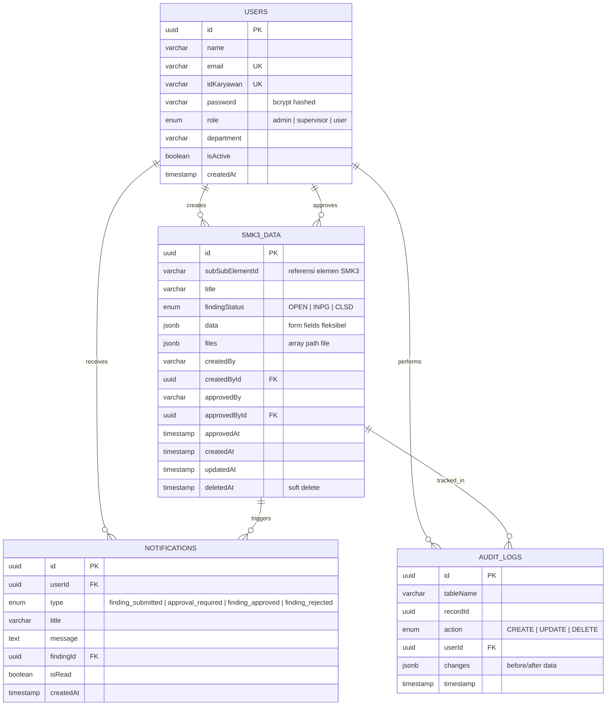
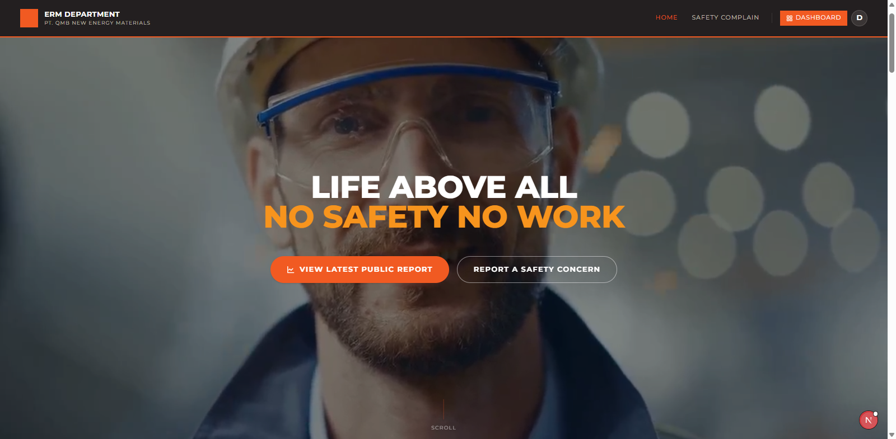
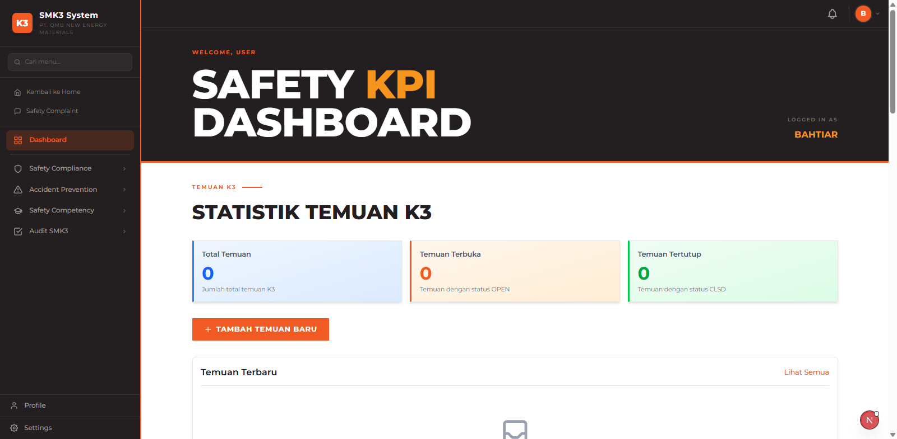
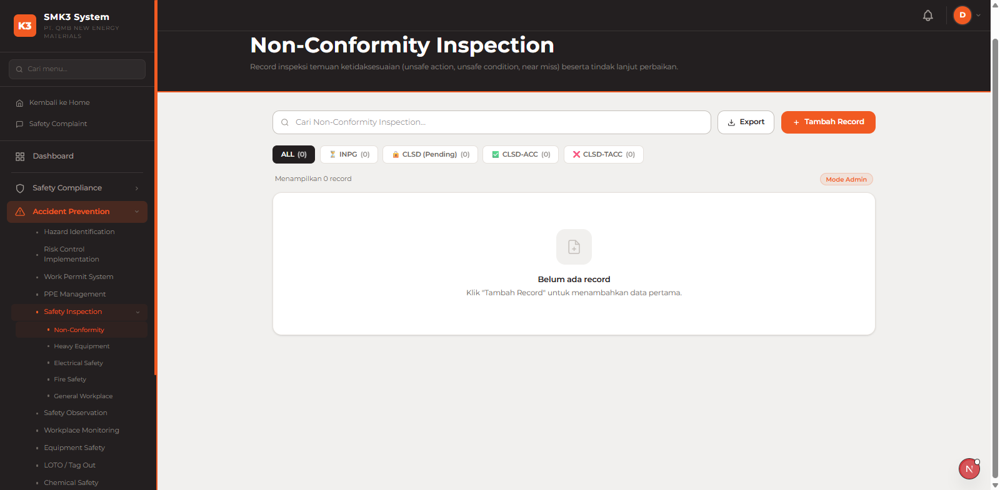
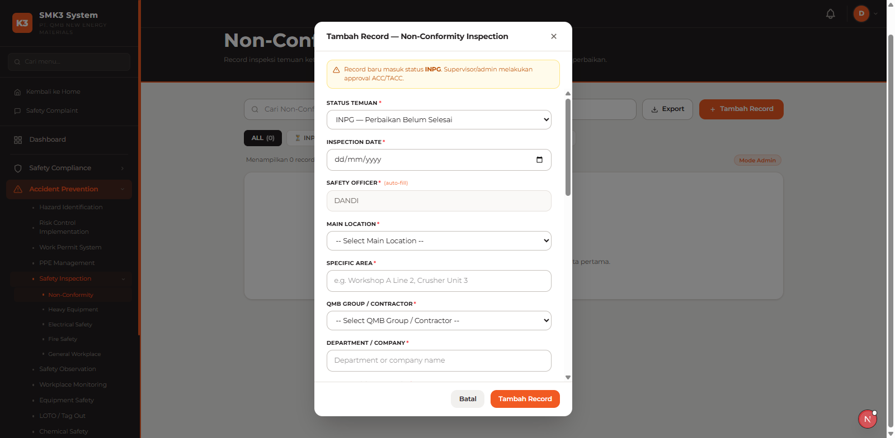
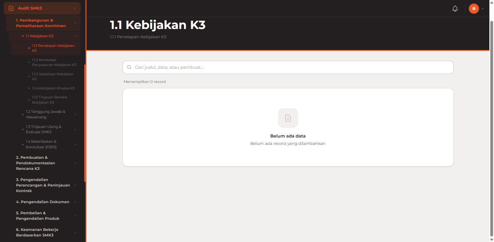
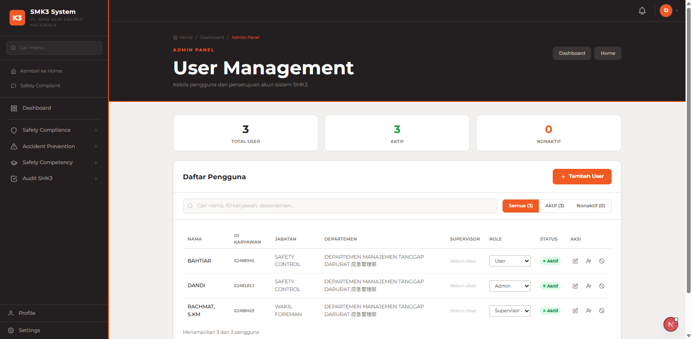
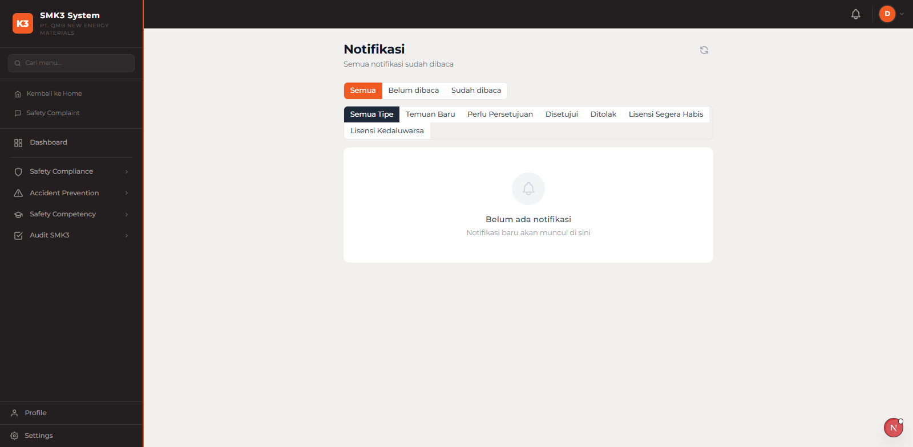

# HAAMI — Hazard Analysis & Awareness Management Integrated

HAAMI adalah platform manajemen Keselamatan dan Kesehatan Kerja (K3) berbasis web yang dirancang untuk membantu organisasi dalam mengelola kepatuhan SMK3, identifikasi bahaya, pelaporan temuan, dan pemantauan kinerja keselamatan secara terpadu. Dibangun dengan teknologi web modern, HAAMI menyediakan solusi end-to-end untuk memenuhi persyaratan **SMK3 (Sistem Manajemen Keselamatan dan Kesehatan Kerja)** berdasarkan PP No. 50 Tahun 2012.

---

## 🔗 Links

| | URL |
|---|---|
| **Frontend (Production)** | _Tambahkan link deployment Vercel di sini_ |
| **Backend API** | _Tambahkan link deployment backend di sini_ |
| **API Docs** | _Tambahkan link dokumentasi API di sini_ |

---

## ✨ Fitur Utama

### Manajemen SMK3
- **12 Elemen SMK3**: Implementasi lengkap 12 elemen SMK3 sesuai regulasi PP 50/2012, mencakup komitmen, rencana K3, pengendalian dokumen, keamanan kerja, pelatihan, pemantauan, hingga pelaporan.
- **CRUD Temuan (Findings)**: Pencatatan, pengelolaan, dan pelacakan temuan ketidaksesuaian dengan alur approval (OPEN → INPG → CLSD).
- **Dashboard SMK3**: Ringkasan status kepatuhan elemen-elemen SMK3 dalam satu halaman.

### Safety Compliance
- **Kebijakan K3**: Upload dan manajemen dokumen kebijakan K3.
- **Legal Compliance**: Pemantauan kepatuhan regulasi dan perundangan K3.
- **K3 Planning & Organization**: Pengelolaan rencana K3 dan struktur organisasi K3.
- **Worker Consultation**: Dokumentasi konsultasi dengan pekerja.
- **Procurement & Contractor Control**: Kontrol pengadaan dan kontraktor.
- **Documentation Records**: Manajemen rekaman dan dokumentasi K3.

### Safety Competency
- **Safety Induction**: Manajemen program induksi keselamatan untuk karyawan baru.
- **Training Management**: Perencanaan dan pelaksanaan pelatihan K3.
- **Training Needs Analysis**: Analisis kebutuhan pelatihan berdasarkan risiko.
- **License & Certification**: Pemantauan sertifikasi dan lisensi K3 karyawan.
- **Safety Briefing & Culture**: Program budaya keselamatan dan safety briefing.
- **Competency Management**: Manajemen kompetensi K3 per jabatan.

### Accident Prevention
- **Hazard Identification**: Identifikasi bahaya dengan kategorisasi level risiko (Low / Medium / High / Critical).
- **Risk Control**: Pengendalian risiko berdasarkan hirarki kontrol.
- **Incident & Near Miss Reporting**: Pelaporan kecelakaan dan hampir celaka.
- **Safety Inspection**: Jadwal dan pelaksanaan inspeksi keselamatan.
- **Work Permit System**: Sistem izin kerja digital untuk pekerjaan berisiko tinggi.
- **PPE Management**: Manajemen Alat Pelindung Diri.
- **LOTO (Lockout/Tagout)**: Prosedur LOTO untuk pekerjaan pada energi berbahaya.
- **Chemical Safety**: Pengelolaan bahan kimia berbahaya.
- **Equipment Safety**: Pemantauan keselamatan peralatan.
- **Emergency Preparedness**: Perencanaan dan kesiapsiagaan darurat.
- **Workplace Monitoring**: Pemantauan lingkungan kerja.
- **Safety Observation**: Program observasi keselamatan.

### Fitur Sistem
- **Autentikasi & RBAC**: Login, forgot/reset/change password, dan kontrol akses berbasis peran (Admin, Supervisor, User).
- **Notifikasi Real-time**: Polling notifikasi otomatis setiap 30 detik untuk approval dan update temuan.
- **Ekspor Data**: Export temuan ke format **Excel (.xlsx)** dan **PDF** dengan tanda tangan digital.
- **Admin Panel**: Manajemen pengguna (aktivasi, deaktivasi, atur supervisor).
- **Profil & Pengaturan**: Manajemen profil pengguna.
- **Signature Digital**: Input tanda tangan digital pada formulir temuan.

---

## 🛠 Tech Stack

### Frontend
| Teknologi | Versi | Kegunaan |
|-----------|-------|----------|
| Next.js | 16.2.6 | React framework dengan App Router & SSR |
| React | 19.2.4 | UI library |
| TypeScript | ^5 | Type-safe development |
| Tailwind CSS | ^4 | Utility-first CSS framework |
| NextAuth.js | ^4.24.14 | Autentikasi & session management |
| React Hook Form | ^7.82.0 | Form state & validasi |
| Zod | ^4.4.3 | Schema validation |
| react-hot-toast | ^2.6.0 | Toast notifications |
| jsPDF | ^4.2.1 | Generate laporan PDF |
| xlsx | ^0.18.5 | Export data ke Excel |
| html2canvas | ^1.4.1 | Render halaman ke canvas (PDF export) |
| react-signature-canvas | ^1.1.0-alpha.2 | Input tanda tangan digital |
| Bun | latest | JavaScript runtime & package manager |

### Backend & Database
| Teknologi | Kegunaan |
|-----------|----------|
| Next.js API Routes | Backend API terintegrasi (autentikasi, users, notifications, SMK3 data) |
| MongoDB + Mongoose | Database utama via API routes |
| bcryptjs | Hashing password |
| NextAuth JWT | Token-based authentication |

> **Catatan**: Arsitektur menggunakan **Next.js fullstack** — API routes di `src/app/api/` menangani backend logic, sehingga tidak memerlukan server terpisah untuk deployment dasar.

### DevOps & Tools
| Teknologi | Kegunaan |
|-----------|----------|
| Vercel | Deployment frontend (rekomendasi) |
| Docker Compose | Orkestrasi kontainer untuk development lokal |
| GitHub Actions | CI/CD pipeline |
| pgAdmin 4 | Database management UI |

---

## 📁 Struktur Proyek

```
crack-fe-naz-ahtamir/
├── apps/
│   └── backend/                    # Backend API (NestJS - opsional, terpisah)
├── public/
│   ├── uploads/                    # File upload lokal (dokumen, PDF)
│   ├── videos/                     # Asset video
│   └── fonts/                      # Custom fonts
├── scripts/                        # Script utilitas (seed data, import karyawan)
│   ├── createAdmin.ts
│   ├── importKaryawan.ts
│   ├── generate-safety-competency.js
│   └── ...
├── src/
│   ├── app/                        # Next.js App Router
│   │   ├── page.tsx                # Landing page publik
│   │   ├── login/                  # Halaman login
│   │   ├── forgot-password/        # Lupa password
│   │   ├── reset-password/         # Reset password
│   │   ├── change-password/        # Ganti password
│   │   ├── contact/                # Halaman kontak
│   │   ├── (authenticated)/        # Route group (butuh autentikasi)
│   │   │   ├── dashboard/          # Dashboard utama
│   │   │   ├── findings/           # Manajemen temuan
│   │   │   ├── notifications/      # Pusat notifikasi
│   │   │   ├── profile/            # Profil pengguna
│   │   │   └── settings/           # Pengaturan akun
│   │   ├── smk3/                   # 12 Elemen SMK3
│   │   │   ├── komitmen/
│   │   │   ├── rencana-k3/
│   │   │   ├── dokumen/
│   │   │   ├── pembelian/
│   │   │   ├── keamanan-kerja/
│   │   │   ├── pelatihan/
│   │   │   ├── pemantauan/
│   │   │   ├── pelaporan/
│   │   │   ├── material/
│   │   │   ├── pemeriksaan/
│   │   │   ├── perancangan-kontrak/
│   │   │   └── data/
│   │   ├── safety-compliance/      # Modul kepatuhan K3
│   │   ├── safety-competency/      # Modul kompetensi K3
│   │   ├── accident-prevention/    # Modul pencegahan kecelakaan
│   │   ├── admin/                  # Panel admin
│   │   ├── dashboard-smk3/         # Dashboard SMK3 khusus
│   │   └── api/                    # Next.js API Routes (backend)
│   │       ├── auth/               # Autentikasi (NextAuth, forgot/reset password)
│   │       ├── users/              # Manajemen pengguna
│   │       ├── notifications/      # Sistem notifikasi
│   │       ├── smk3-data/          # Data temuan SMK3
│   │       ├── kebijakan/          # Kebijakan K3
│   │       └── konsultasi/         # Konsultasi K3
│   ├── components/                 # Komponen React reusable
│   │   ├── ui/                     # Button, Input, Modal, Badge, dll.
│   │   ├── layout/                 # Sidebar, Header, NotificationDropdown
│   │   ├── dashboard/              # StatCard, RecentFindings
│   │   ├── findings/               # FindingForm
│   │   ├── CrudPage.tsx            # Generic CRUD component
│   │   ├── SMK3DataList.tsx        # List data SMK3
│   │   └── RecordTable.tsx         # Tabel data generik
│   ├── contexts/                   # React Context
│   │   ├── AuthContext.tsx         # State autentikasi global
│   │   └── NotificationContext.tsx # State notifikasi global
│   ├── hooks/                      # Custom React hooks
│   │   └── useNotificationPolling.ts
│   ├── lib/                        # Utility & API clients
│   │   ├── api.ts                  # API client utama
│   │   ├── auth.ts                 # Auth utilities
│   │   ├── exportFindingToPDF.ts   # Export PDF
│   │   └── exportFindingsToExcel.ts # Export Excel
│   ├── data/                       # Data statis (form configs, jobdesk)
│   ├── models/                     # Mongoose models
│   └── types/                      # TypeScript type definitions
├── .env.local                      # Environment variables
├── .env.local.example              # Contoh konfigurasi environment
├── next.config.ts                  # Konfigurasi Next.js
├── package.json                    # Dependencies & scripts
└── tsconfig.json                   # Konfigurasi TypeScript
```

---

## 🚀 Instalasi & Penggunaan

### Prasyarat

- **Node.js** 18.17 atau lebih baru
- **Bun** (direkomendasikan) atau npm/yarn
- **MongoDB** (lokal atau MongoDB Atlas)

### Langkah Instalasi

**1. Clone repository**
```bash
git clone <repo-url>
cd crack-fe-naz-ahtamir
```

**2. Install dependencies**
```bash
bun install
# atau
npm install
```

**3. Konfigurasi environment**
```bash
cp .env.local.example .env.local
```

Edit `.env.local` sesuai konfigurasi Anda:
```env
# MongoDB Connection
MONGODB_URI=mongodb+srv://<user>:<password>@cluster.mongodb.net/<dbname>

# NextAuth Configuration
NEXTAUTH_URL=http://localhost:3000
NEXTAUTH_SECRET=<generate dengan: openssl rand -base64 32>

# Backend API (jika menggunakan NestJS terpisah)
NEXT_PUBLIC_API_URL=http://localhost:3001/api
NEXT_PUBLIC_FRONTEND_URL=http://localhost:3000
```

**4. Buat akun admin pertama**
```bash
bun run create-admin
```

**5. Jalankan development server**
```bash
bun run dev
```

Aplikasi akan berjalan di **http://localhost:3000**

---

### Scripts yang Tersedia

| Script | Perintah | Keterangan |
|--------|----------|------------|
| Development | `bun run dev` | Jalankan dev server dengan hot reload |
| Build | `bun run build` | Build untuk production |
| Start | `bun run start` | Jalankan production server |
| Lint | `bun run lint` | Jalankan ESLint |
| Create Admin | `bun run create-admin` | Buat akun admin pertama |
| Import Karyawan | `bun run import-karyawan` | Import data karyawan dari CSV |

---

### Akun Default (setelah setup)

| Role | Email | Akses |
|------|-------|-------|
| Admin | Dibuat via `bun run create-admin` | Penuh — manajemen user, semua modul |
| Supervisor | Dibuat oleh admin | Approval temuan, lihat semua data |
| User | Dibuat oleh admin | Buat & lihat temuan sendiri |

---

## 📊 ERD (Entity Relationship Diagram)



### Penjelasan Relasi

| Relasi | Keterangan |
|--------|------------|
| `USERS` → `SMK3_DATA` (creates) | Satu user dapat membuat banyak temuan |
| `USERS` → `SMK3_DATA` (approves) | Satu supervisor/admin dapat menyetujui banyak temuan |
| `USERS` → `NOTIFICATIONS` | Satu user menerima banyak notifikasi |
| `SMK3_DATA` → `NOTIFICATIONS` | Satu temuan dapat memicu banyak notifikasi (ke creator & supervisors) |
| `USERS` → `AUDIT_LOGS` | Setiap aksi user tercatat di audit log |
| `SMK3_DATA` → `AUDIT_LOGS` | Setiap perubahan temuan dilacak di audit log |

### Alur Status Temuan

```
OPEN  ──► INPG (In Progress)  ──► CLSD (Closed)
  │                                     ▲
  └─────────────────────────────────────┘
         (langsung approve ke CLSD)
```

---

## 📸 Screenshots

> **Catatan**: Tambahkan screenshot aplikasi di folder `public/screenshots/` lalu update path di bawah ini.

### Landing Page

> Halaman publik HAAMI dengan informasi produk, fitur, dan CTA login.

### Dashboard Utama

> Dashboard menampilkan statistik temuan (OPEN/INPG/CLSD), grafik tren, dan recent findings.

### Manajemen Temuan (Findings)

> Daftar semua temuan dengan filter status, kategori, dan fitur export ke Excel/PDF.

### Form Buat Temuan Baru

> Form pencatatan temuan baru dengan upload foto, input tanda tangan digital, dan validasi.

### Modul SMK3

> 12 Elemen SMK3 yang dapat dikelola, masing-masing dengan sub-elemen dan formulir data.

### Dashboard SMK3

> Dashboard khusus SMK3 dengan status kepatuhan per elemen dan statistik keseluruhan.

### Admin Panel

> Panel administrasi untuk manajemen pengguna — aktivasi, deaktivasi, dan atur supervisor.

### Notifikasi

> Pusat notifikasi untuk approval temuan, status update, dan pesan sistem.

---

## 🔒 Fitur Keamanan

- **JWT Authentication** via NextAuth.js — token-based session management
- **Role-Based Access Control (RBAC)** — Admin, Supervisor, User dengan hak akses berbeda
- **Password Hashing** — bcryptjs dengan salt rounds
- **Forgot/Reset Password** — Alur reset password via token
- **Protected Routes** — Middleware Next.js memblokir akses tanpa autentikasi
- **Input Validation** — Zod schema validation di setiap form dan API endpoint
- **Audit Logging** — Setiap perubahan data tercatat dengan user dan timestamp
- **Soft Delete** — Data temuan tidak dihapus permanen (deletedAt)

---

## 🚢 Deployment

### Frontend — Vercel (Rekomendasi)

1. Push kode ke repository GitHub
2. Connect repository ke [Vercel](https://vercel.com)
3. Tambahkan environment variables di Vercel dashboard:
   - `MONGODB_URI`
   - `NEXTAUTH_URL` (URL production)
   - `NEXTAUTH_SECRET`
   - `NEXT_PUBLIC_API_URL`
4. Deploy otomatis setiap push ke branch `main`

### Backend Terpisah (Opsional)

Jika menggunakan NestJS backend terpisah:

| Platform | Catatan |
|----------|---------|
| Railway | Rekomendasi — mudah setup PostgreSQL & Redis |
| Render | Free tier tersedia |
| AWS Elastic Beanstalk | Untuk skala enterprise |
| Docker | `docker-compose up` untuk lokal development |

---

## 🤝 Kontribusi

1. Fork repository ini
2. Buat branch baru: `git checkout -b feature/nama-fitur`
3. Commit perubahan: `git commit -m 'feat: tambah fitur X'`
4. Push branch: `git push origin feature/nama-fitur`
5. Buat Pull Request

### Konvensi Commit
- `feat:` — Fitur baru
- `fix:` — Bug fix
- `docs:` — Perubahan dokumentasi
- `style:` — Formatting (tidak mengubah logic)
- `refactor:` — Refactoring kode
- `chore:` — Maintenance (update deps, config, dll.)

---

## 📄 Lisensi

Proyek ini adalah perangkat lunak proprietary. Semua hak dilindungi.

---

## 📞 Support

- Buat issue di GitHub repository
- Hubungi tim pengembang: support@haami-safety.com
- Dokumentasi lengkap: [docs.haami-safety.com](https://docs.haami-safety.com)

---

**HAAMI — Making workplaces safer, one hazard at a time.**

*Terakhir diperbarui: September 2026*
